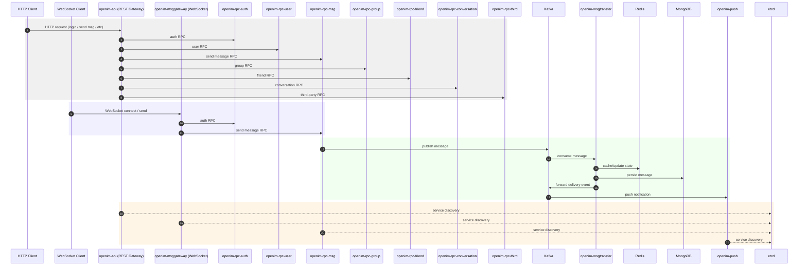
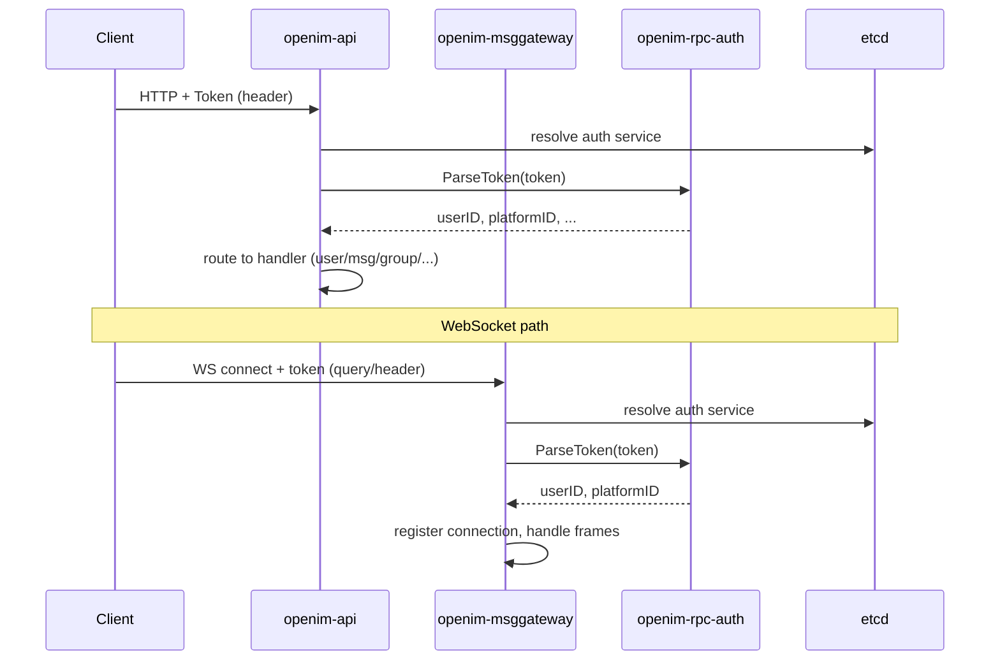
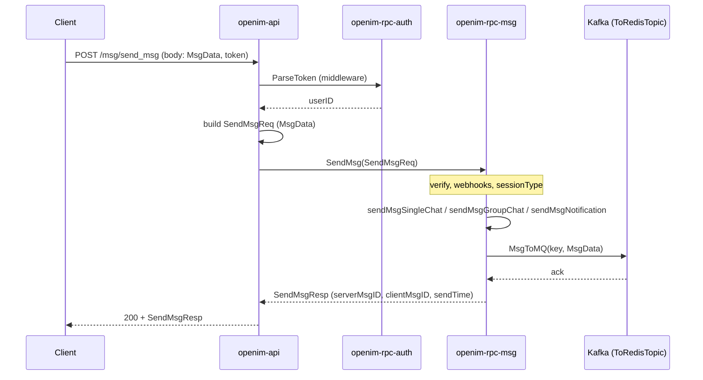
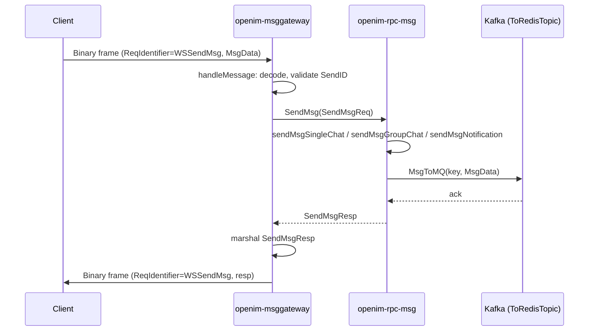
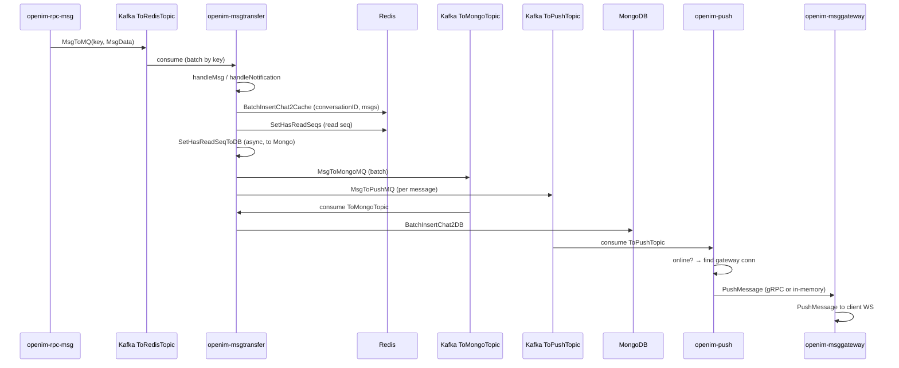
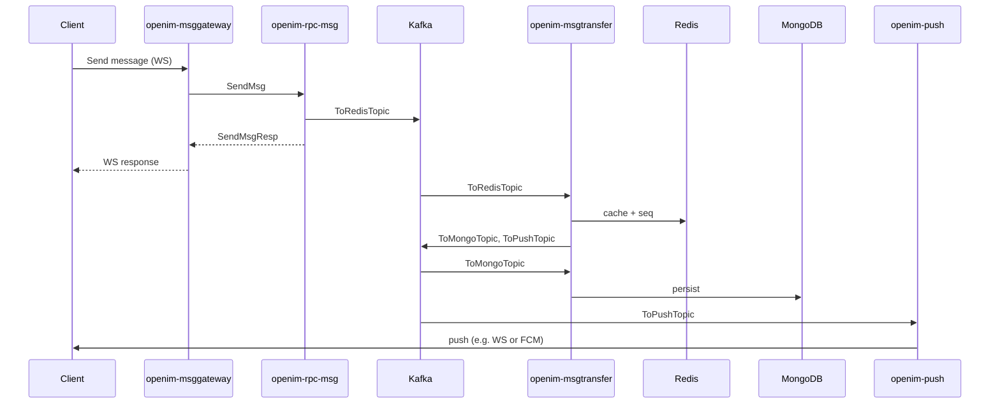
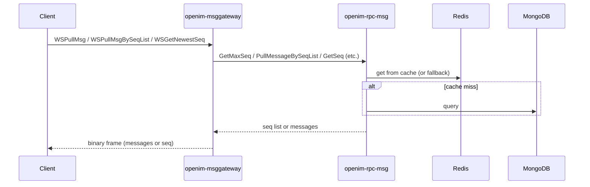
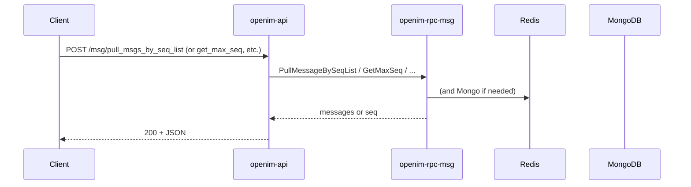

# OpenIM Server — Process Flow

This document describes where requests start, how they move through the system, and where they end. Diagrams are in Mermaid (render in GitHub, VS Code, or any Mermaid-capable viewer).

---

## 1. High-level architecture

- **Request start:** HTTP at `openim-api` or WebSocket at `openim-msggateway`.
- **Request end:** Either a response back to the client (sync) or completion of async pipeline (Kafka → msgtransfer → Redis/Mongo/Push).

---

## 2. Request entry points and destinations

| Entry point | Typical use | Ends at |
|-------------|-------------|---------|
| **openim-api** (REST) | Register, login, send msg, sync, friends, groups, conversation, object upload | openim-api returns HTTP response after calling one or more RPCs |
| **openim-msggateway** (WebSocket) | Send msg, pull msg, get seq, logout, subscribe status | openim-msggateway returns binary frame; for send/pull it calls openim-rpc-msg |
| **Kafka (ToRedisTopic)** | Produced by openim-rpc-msg | Consumed by openim-msgtransfer |
| **Kafka (ToMongoTopic)** | Produced by openim-msgtransfer | Consumed by openim-msgtransfer (persist to MongoDB) |
| **Kafka (ToPushTopic)** | Produced by openim-msgtransfer | Consumed by openim-push → delivery to devices / gateway |

---

## 3. Authentication flow (token)

Every API and gateway request that needs auth goes through token parsing first.

- **Starts at:** Client (HTTP request or WebSocket upgrade).
- **Ends at:** openim-api or openim-msggateway has user identity; subsequent logic uses it (e.g. call msg RPC with SendID).

---

## 4. Send message — REST path

From HTTP POST to response and to Kafka.

- **Starts at:** Client HTTP POST to `/msg/send_msg`.
- **Ends at:**  
  - **Sync:** Client gets HTTP 200 + `SendMsgResp`.  
  - **Async:** Message is in Kafka `ToRedisTopic`; msgtransfer will consume it (see below).

---

## 5. Send message — WebSocket path

From WebSocket binary frame to response and to Kafka.

- **Starts at:** Client sends a WebSocket binary message with `WSSendMsg` and payload.
- **Ends at:**  
  - **Sync:** Client receives a WebSocket frame with the send response.  
  - **Async:** Same as REST: message is in Kafka `ToRedisTopic`.

---

## 6. Message pipeline (Kafka → storage and push)

After openim-rpc-msg writes to Kafka, openim-msgtransfer and openim-push complete the flow.

- **Starts at:** openim-rpc-msg produces to **ToRedisTopic** (end of send flow above).
- **Ends at:**  
  - **Redis:** Conversation cache and has-read seq updated.  
  - **MongoDB:** Message persisted via ToMongoTopic consumer.  
  - **Push:** ToPushTopic → openim-push → online users via gateway (WebSocket); offline via FCM/other.

---

## 7. End-to-end send message (single flow)

Single diagram from client send to storage and push.

---

## 8. Pull message / get seq (WebSocket)

Client reads history or latest seq via gateway.

- **Starts at:** Client sends WebSocket request (e.g. pull by seq list or get newest seq).
- **Ends at:** Client receives messages or seq from openim-msggateway; data comes from openim-rpc-msg (Redis/Mongo).

---

## 9. Pull message / get seq (REST)

Same logical flow via HTTP.

- **Starts at:** Client HTTP POST to `/msg/*` (pull/get seq).
- **Ends at:** Client gets HTTP 200 with messages or seq.

---

## 10. Other API flows (summary)

| Flow | Start | End |
|------|--------|-----|
| **User register / update** | POST /user/* → openim-api | openim-rpc-user → MongoDB/Redis; response to client |
| **Friend add / list** | POST /friend/* → openim-api | openim-rpc-friend → DB; response to client |
| **Group create / invite** | POST /group/* → openim-api | openim-rpc-group (and sometimes user/relation); response to client |
| **Conversation** | POST /conversation/* → openim-api | openim-rpc-conversation; response to client |
| **Object upload / sign** | POST /object/*, /third/* → openim-api | openim-rpc-third (+ MinIO/OSS/COS); response to client |
| **Token / force logout** | POST /auth/* → openim-api | openim-rpc-auth; response to client |

All of these: **start** at client → openim-api; **end** at openim-api returning HTTP response after RPC and optional DB writes.

---

## 11. Kafka topics (summary)

| Topic | Producer | Consumer | Purpose |
|-------|----------|----------|---------|
| **ToRedisTopic** | openim-rpc-msg | openim-msgtransfer | New messages to cache and forward |
| **ToMongoTopic** | openim-msgtransfer | openim-msgtransfer | Persist messages to MongoDB |
| **ToPushTopic** | openim-msgtransfer | openim-push | Deliver to online/offline users |
| **ToOfflinePushTopic** | openim-push (internal) | openim-push | Offline push pipeline (if used) |

---

## 12. Service discovery

- **openim-api** and **openim-msggateway** (and other RPCs) use **etcd** to discover RPC endpoints.
- On startup they get gRPC connections to openim-rpc-auth, openim-rpc-msg, openim-rpc-user, etc., via `discovery.SvcDiscoveryRegistry` / `GetConn(ctx, serviceName)`.
- So every “API → RPC” or “gateway → RPC” arrow in the diagrams goes through discovery (etcd) to get the target address.

---

## 13. Where to look in code

| What you trace | Where to look |
|----------------|----------------|
| REST routes and which RPC is called | `internal/api/router.go`, `internal/api/*.go` (e.g. `msg.go`, `user.go`) |
| WebSocket message types and handler | `internal/msggateway/client.go` (handleMessage switch), `internal/msggateway/message_handler.go` |
| SendMsg and MsgToMQ | `internal/rpc/msg/send.go`, `pkg/common/storage/controller/msg.go` |
| Kafka producer (ToRedisTopic) | `internal/rpc/msg/server.go` (builder.GetTopicProducer ToRedisTopic), `MsgToMQ` in msg.go |
| Consume ToRedisTopic, write Redis/Mongo/Push | `internal/msgtransfer/online_history_msg_handler.go`, `internal/msgtransfer/init.go` |
| Consume ToMongoTopic, persist | `internal/msgtransfer/online_msg_to_mongo_handler.go`, `init.go` |
| Consume ToPushTopic, push to user | `internal/push/push.go`, push handler |
| Token parsing | `internal/api/router.go` (GinParseToken), `internal/msggateway/ws_server.go` (ParseToken), `internal/rpc/auth` |

Use this with [DEVELOPER.md](README.md) to follow a request from entry (API or gateway) to RPC, Kafka, storage, and push.
