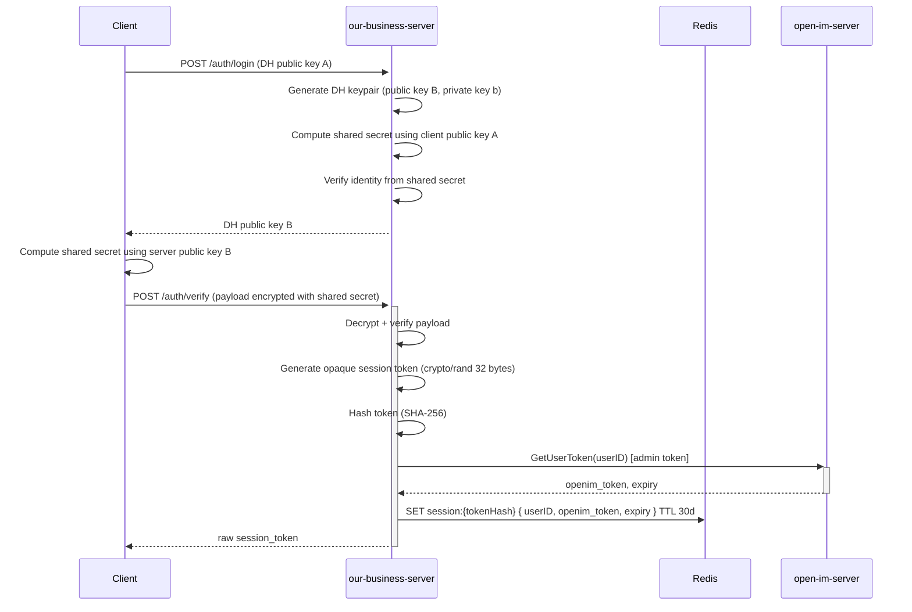
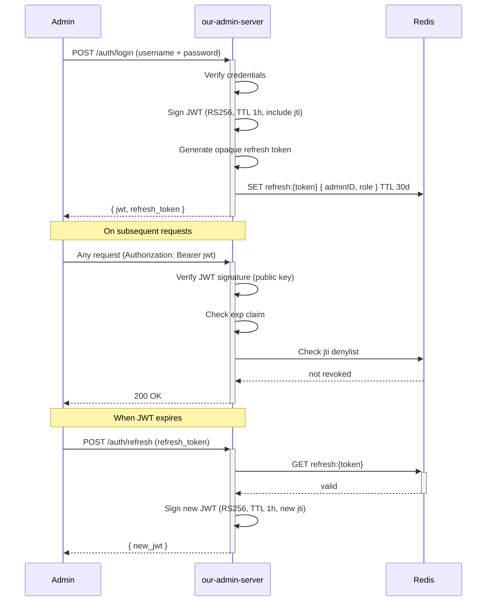
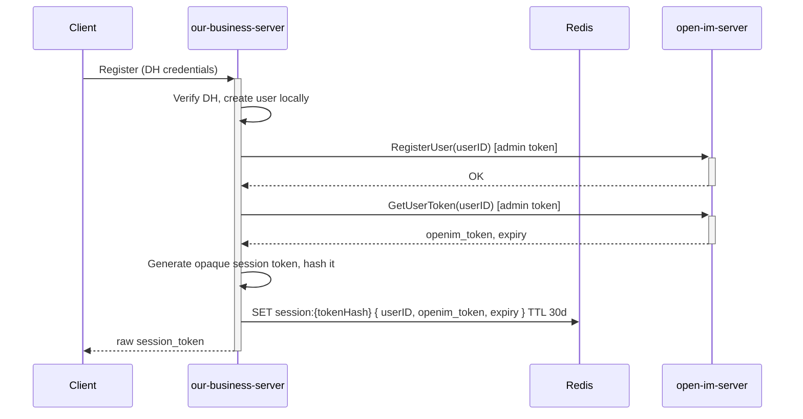
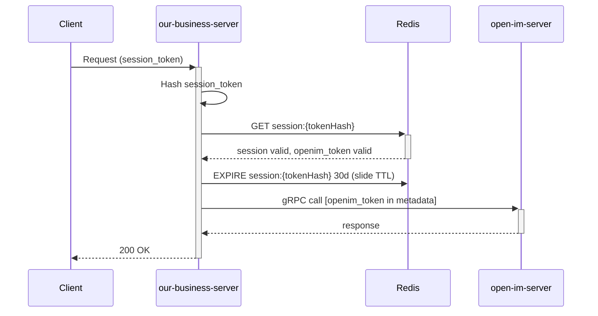
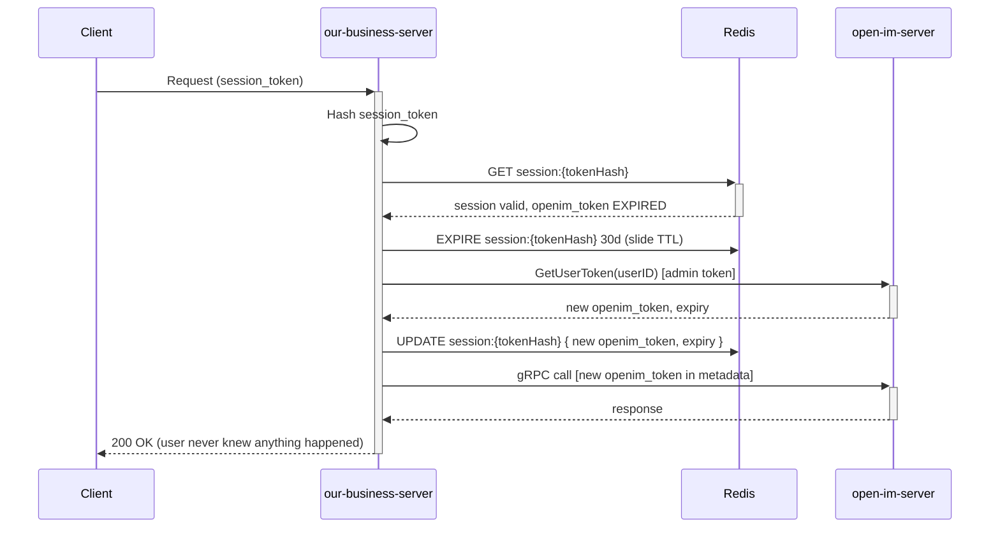
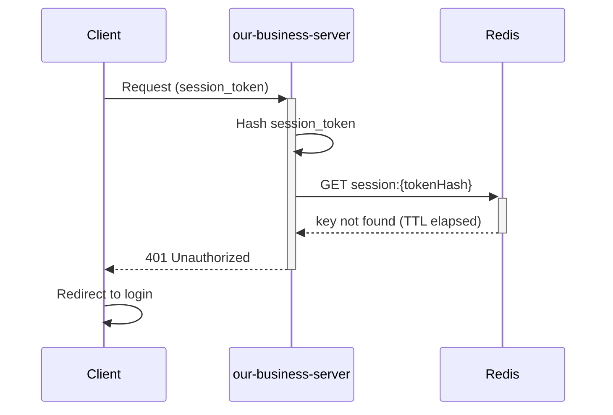
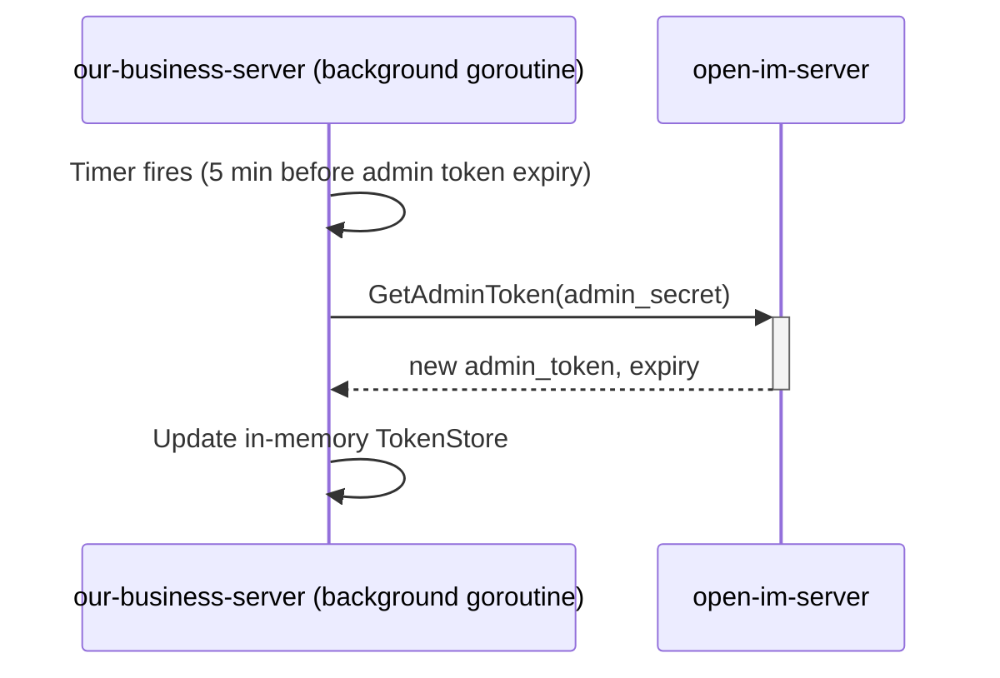

# Authentication & Session Management Guide

This document covers the full authentication architecture across **our-business-server**, **our-admin-server**, and **open-im-server**. It includes token types, session management, registration flow, and all expiration/failure cases.

---

## Table of Contents

1. [Token Types](#1-token-types)
2. [Inbound Auth — Who Talks to Our Servers](#2-inbound-auth--who-talks-to-our-servers)
3. [Outbound Auth — Our Servers Talking to open-im-server](#3-outbound-auth--our-servers-talking-to-open-im-server)
4. [User Registration Flow](#4-user-registration-flow)
5. [User Login & Session Flow](#5-user-login--session-flow)
6. [Session Management](#6-session-management)
7. [OpenIM Token Lifecycle & Refresh](#7-openim-token-lifecycle--refresh)
8. [Failure & Expiration Cases](#8-failure--expiration-cases)
9. [Sequence Diagrams](#9-sequence-diagrams)

---

## 1. Token Types

There are four distinct tokens in this system across two servers. They serve different purposes and must not be confused with each other.

| Token | Format | Issued By | Held By | Visible To | Represents |
|-------|--------|-----------|---------|------------|------------|
| **DH session token** | Opaque (random bytes) | our-business-server | End user (client) | End user only | "This user is logged into our system" |
| **Admin JWT** | JWT (RS256) | our-admin-server | Admin user (client) | Admin only | "This admin is authenticated" |
| **OpenIM user token** | JWT (OpenIM-signed) | open-im-server | our-business-server (Redis, per user) | Never exposed | "This user is authenticated in OpenIM" |
| **OpenIM admin token** | JWT (OpenIM-signed) | open-im-server | our-business-server + our-admin-server (memory) | Never exposed | "This server is a trusted backend service" |

> **Important:** Both OpenIM tokens (user and admin) are JWTs — they are issued and signed by open-im-server using its own signing key. The difference between them is not the format but the userID embedded in the claims. The admin token's userID maps to the designated admin user in open-im-server, which grants it elevated privileges on protected routes.

### 1.1 DH session token (end user)

- Issued by our-business-server after a successful DH handshake at login
- Opaque random token (e.g. 256-bit hex, stored in Redis) — not a JWT, no decodable claims
- Stored in Redis with a sliding TTL (e.g. 30 days, reset on every active request)
- This is the only credential your end users ever see or send
- Has nothing to do with OpenIM directly — it is purely your system's identity for the user

**Why opaque over JWT for end users?**
- Cannot be decoded client-side — no information leakage
- Can be instantly invalidated by deleting the Redis key (JWT cannot be revoked without a denylist)
- Simpler to rotate and manage at scale

### 1.2 Admin JWT

- Issued by our-admin-server (or a dedicated identity provider) after admin login
- Signed JWT (RS256 or HS256) with claims: `admin_id`, `role`, `exp`, `iat`
- Short-lived TTL (e.g. 1 hour) — admins are expected to re-authenticate or use a refresh token
- Verified on every request using the public key or shared secret — stateless, no Redis lookup needed
- Has nothing to do with OpenIM directly

**Why JWT for admins?**
- Admin sessions are short-lived and low volume — stateless verification is fine
- Claims carry role/permission info without a DB lookup
- Easy to integrate with existing identity providers (SSO, OAuth2)
- Acceptable trade-off: short TTL limits the damage window if a token is compromised

**Best practices for admin JWT:**
- Use RS256 (asymmetric) so the public key can be shared without exposing the signing key
- Keep TTL short (1 hour max) — use a separate refresh token flow for re-issue
- Include a `jti` (JWT ID) claim and maintain a small denylist in Redis for explicit revocation (logout, compromise)
- Never put sensitive data in JWT claims — treat them as public

```go
// Verify admin JWT on every request
func (m *AdminAuthMiddleware) Verify(tokenStr string) (*AdminClaims, error) {
    token, err := jwt.ParseWithClaims(tokenStr, &AdminClaims{}, func(t *jwt.Token) (any, error) {
        if _, ok := t.Method.(*jwt.SigningMethodRSA); !ok {
            return nil, fmt.Errorf("unexpected signing method: %v", t.Header["alg"])
        }
        return m.publicKey, nil
    })
    if err != nil || !token.Valid {
        return nil, ErrInvalidAdminToken
    }
    claims := token.Claims.(*AdminClaims)
    // Check denylist (for revoked tokens)
    if m.isDenylisted(claims.ID) {
        return nil, ErrRevokedAdminToken
    }
    return claims, nil
}
```

### 1.3 OpenIM user token

- A JWT issued and signed by open-im-server — not by us
- Has a fixed TTL set in open-im-server's config (set this long, e.g. 30 days)
- Stored in Redis by our-business-server alongside the DH session: `session:{tokenHash}`
- End users never see this token — it is completely internal
- Used only on outbound gRPC calls from our-business-server → open-im-server
- **When it expires, it is silently re-issued via `GetUserToken` using the admin token — no user re-login required**

### 1.4 OpenIM admin token

- Also a JWT issued and signed by open-im-server — same format as the user token
- The only difference from a user token is that its userID maps to the designated admin user in open-im-server, which open-im-server uses to grant elevated privileges
- Acquired at startup by calling open-im-server's `GetAdminToken` RPC with the admin secret configured in open-im-server's config
- Stored in memory only — never in Redis or DB
- Refreshed in the background before expiry via the same `GetAdminToken` RPC
- **Its primary purpose in our system: call `GetUserToken(anyUserID)` to silently re-issue an expired OpenIM user token without any user interaction**

> **There is no refresh token concept on the OpenIM side.** The admin token IS the re-issue mechanism. When a user's OpenIM JWT expires, our-business-server calls `GetUserToken(userID)` using the admin token and gets a brand new JWT back — one RPC call, completely transparent to the user. This is by design.

```go
// How to acquire the OpenIM admin token at startup
resp, err := authClient.GetAdminToken(ctx, &authpb.GetAdminTokenReq{
    Secret:   cfg.OpenIM.AdminSecret, // from our config, matches open-im-server config
    UserID:   cfg.OpenIM.AdminUserID, // the designated admin userID in open-im-server
    Platform: 1,
})
// Store resp.Token in memory — this is your admin token

// How to re-issue any user's OpenIM token using the admin token
resp, err := authClient.GetUserToken(ctx, &authpb.GetUserTokenReq{
    UserID:   targetUserID,
    Platform: session.Platform,
})
// resp.Token is the fresh OpenIM user JWT — store back in Redis
```

---

## 2. Inbound Auth — Who Talks to Our Servers

Each server owns its own inbound authentication. There is no shared gateway doing auth on behalf of both. Neither server knows or cares about the other's auth mechanism.

```
[ End User ]   →  DH handshake + opaque session token   →  [ our-business-server ]
[ Admin ]      →  JWT (RS256)                           →  [ our-admin-server ]
```

### 2.1 our-business-server — DH Authentication

#### The handshake flow

DH (Diffie-Hellman) is used to establish a shared secret between the client and server without transmitting the secret over the wire. This is used for the initial login/registration to derive a secure channel before issuing a session token.

```
1. Client generates DH keypair (public key A, private key a)
2. Client sends public key A to our-business-server
3. our-business-server generates its own DH keypair (public key B, private key b)
4. our-business-server sends public key B back to client
5. Both sides independently compute the shared secret:
     Client:  sharedSecret = A^b mod p  (using server's public key + own private key)
     Server:  sharedSecret = B^a mod p  (using client's public key + own private key)
6. Shared secret is used to verify identity / encrypt subsequent auth payload
7. our-business-server issues an opaque session token and stores it in Redis
8. Client uses the session token on all subsequent requests (Authorization header)
```

#### Middleware on every request

After the handshake, the client sends the opaque session token. The middleware validates it against Redis:

```go
func (m *DHAuthMiddleware) Handle() gin.HandlerFunc {
    return func(c *gin.Context) {
        token := strings.TrimPrefix(c.GetHeader("Authorization"), "Bearer ")
        if token == "" {
            c.AbortWithStatusJSON(http.StatusUnauthorized, gin.H{"error": "missing token"})
            return
        }
        session, err := m.redis.Get(c.Request.Context(), "session:"+token)
        if err != nil {
            // Key not found = expired or invalid
            c.AbortWithStatusJSON(http.StatusUnauthorized, gin.H{"error": "invalid or expired session"})
            return
        }
        // Slide the TTL on every active request
        m.redis.Expire(c.Request.Context(), "session:"+token, 30*24*time.Hour)
        // Attach userID to context for downstream use
        c.Set("userID", session.UserID)
        c.Set("openimToken", session.OpenIMToken)
        c.Next()
    }
}
```

#### Best practices for DH session tokens

- Generate the opaque token with a cryptographically secure random source (`crypto/rand`) — never `math/rand`
- Use at least 256 bits of entropy (32 bytes, hex-encoded = 64 char string)
- Store only the token hash in Redis, not the raw token, so a Redis compromise does not leak valid tokens
- Use a Redis key prefix strategy: `session:{tokenHash}` → `{ userID, openimToken, ... }`
- Always slide the TTL on every authenticated request — never let an active user get logged out

```go
func generateSessionToken() (raw string, hashed string, err error) {
    b := make([]byte, 32)
    if _, err = rand.Read(b); err != nil {
        return
    }
    raw = hex.EncodeToString(b)
    h := sha256.Sum256(b)
    hashed = hex.EncodeToString(h[:])
    return
}
```

### 2.2 our-admin-server — JWT Authentication

#### The login flow

```
1. Admin submits credentials (username + password, or SSO)
2. our-admin-server verifies credentials
3. Issues a signed JWT (RS256) with claims: admin_id, role, exp, iat, jti
4. Optionally issues a separate refresh token (opaque, stored in Redis) for re-issue
5. Admin sends JWT as Bearer token on every subsequent request
```

#### Middleware on every request

JWT is stateless — no Redis lookup needed for standard validation. Only the denylist check hits Redis (for explicit revocation).

```go
func (m *JWTAuthMiddleware) Handle() gin.HandlerFunc {
    return func(c *gin.Context) {
        tokenStr := strings.TrimPrefix(c.GetHeader("Authorization"), "Bearer ")
        if tokenStr == "" {
            c.AbortWithStatusJSON(http.StatusUnauthorized, gin.H{"error": "missing token"})
            return
        }
        claims, err := m.verifyJWT(tokenStr)
        if err != nil {
            c.AbortWithStatusJSON(http.StatusUnauthorized, gin.H{"error": err.Error()})
            return
        }
        c.Set("adminID", claims.AdminID)
        c.Set("role", claims.Role)
        c.Next()
    }
}

type AdminClaims struct {
    AdminID string `json:"admin_id"`
    Role    string `json:"role"`
    jwt.RegisteredClaims
}
```

#### Admin refresh token flow

Since admin JWTs are short-lived (1 hour), use a separate opaque refresh token to re-issue without forcing re-login:

```
1. Admin JWT expires
2. Client sends refresh token to POST /auth/refresh
3. our-admin-server validates refresh token in Redis (not expired, not revoked)
4. Issues a new JWT
5. Optionally rotates the refresh token (single-use refresh tokens)
```

#### Best practices for admin JWT

- Use **RS256** (asymmetric signing) — the private key signs, the public key verifies. The public key can be distributed freely; the private key never leaves the server.
- Keep JWT TTL short: **1 hour or less**
- Always include `jti` (JWT ID) and maintain a Redis denylist for explicit revocation (logout, compromise, role change)
- Rotate signing keys periodically — support multiple valid public keys during rotation
- Never put sensitive data (passwords, secrets) in JWT claims — claims are base64-encoded, not encrypted
- Scope JWTs to the service — include an `aud` (audience) claim set to `our-admin-server` so tokens from other services are rejected

---

## 3. Outbound Auth — Our Servers Talking to open-im-server

Both our-business-server and our-admin-server use the **OpenIM admin token** for outbound gRPC calls to open-im-server. This is handled transparently by a client-side gRPC unary interceptor so individual use cases never manually attach tokens.

```go
func AdminTokenInterceptor(tokenStore *TokenStore) grpc.UnaryClientInterceptor {
    return func(ctx context.Context, method string, req, reply any,
        cc *grpc.ClientConn, invoker grpc.UnaryInvoker, opts ...grpc.CallOption) error {
        ctx = metadata.AppendToOutgoingContext(ctx, "token", tokenStore.Get())
        return invoker(ctx, method, req, reply, cc, opts...)
    }
}
```

For calls that are on behalf of a specific user (e.g. sending a message as a user), the OpenIM user token is attached instead:

```go
func UserTokenInterceptor(token string) grpc.UnaryClientInterceptor {
    return func(ctx context.Context, method string, req, reply any,
        cc *grpc.ClientConn, invoker grpc.UnaryInvoker, opts ...grpc.CallOption) error {
        ctx = metadata.AppendToOutgoingContext(ctx, "token", token)
        return invoker(ctx, method, req, reply, cc, opts...)
    }
}
```

---

## 4. User Registration Flow

When a user registers on our-business-server, they must also be created in open-im-server so they exist in the IM system. This happens in the same registration flow, transparently.

```
1. User submits registration to our-business-server
2. our-business-server creates the user in its own flow (DH setup, etc.)
3. our-business-server calls open-im-server RegisterUser (using admin token)
4. open-im-server creates the user internally
5. our-business-server calls open-im-server GetUserToken (using admin token) to pre-fetch the user's OpenIM token
6. Stores OpenIM token in Redis alongside the session
7. Registration complete — user exists in both systems
```

If step 3 fails, treat the registration as failed and roll back. The user must exist in both systems to function correctly.

---

## 5. User Login & Session Flow

```
1. User submits DH handshake to our-business-server
2. our-business-server verifies DH
3. our-business-server issues a session token (opaque or JWT)
4. our-business-server fetches/refreshes the user's OpenIM token (GetUserToken via admin token)
5. Stores in Redis:
     session:{userID} → {
         session_token,
         openim_token,
         openim_token_expiry,
         last_active
     }
6. Returns session token to the user
```

The user only ever receives the session token. The OpenIM token is internal.

---

## 6. Session Management

Sessions are stored in Redis with a **sliding TTL**. Every request from an active user resets the TTL so they are never logged out while active.

### 6.1 Redis session structure

```
Key:   session:{userID}
Value: {
    session_token:        "abc123...",
    openim_token:         "eyJ...",
    openim_token_expiry:  "2026-04-01T12:00:00Z",
    platform:             "iOS",
    last_active:          "2026-03-02T10:00:00Z"
}
TTL:   30 days (reset on every request)
```

### 6.2 Sliding TTL on every request

In your auth middleware, after validating the session token, reset the TTL:

```go
func (m *AuthMiddleware) Validate(ctx context.Context, sessionToken string) (*Session, error) {
    session, err := m.redis.Get(ctx, "session:"+userID)
    if err != nil {
        return nil, ErrSessionNotFound
    }
    // Slide the TTL
    m.redis.Expire(ctx, "session:"+userID, 30*24*time.Hour)
    return session, nil
}
```

### 6.3 Session invalidation

To log a user out, simply delete the Redis key:

```go
m.redis.Del(ctx, "session:"+userID)
```

---

## 7. OpenIM Token Lifecycle & Re-issue

The OpenIM user token is a JWT with a fixed TTL set in open-im-server's config. Since your user session is long-lived and sliding, the OpenIM token will inevitably expire during an active session. This is handled entirely on the backend — the user never knows it happened.

> **There is no refresh token flow on the OpenIM side.** Do not look for one. The admin token is the re-issue mechanism. When a user's OpenIM JWT expires, our-business-server calls `GetUserToken(userID)` using the admin token and receives a brand new JWT. One RPC call. That's it.

### 7.1 Strategy

Set OpenIM's token TTL as long as reasonably possible (e.g. 30 days) in open-im-server's config to minimize how often re-issue is needed. But always have the `GetUserToken` call ready as a fallback — it will never fail as long as the admin token is valid and open-im-server is reachable.

### 7.2 How OpenIM's auth works internally (important context)

When our-business-server calls a protected open-im-server route, open-im-server:

1. Extracts the token from gRPC metadata (`token` key)
2. Validates the JWT signature using its own signing key
3. Extracts the userID from the claims
4. Checks if the route requires admin-level access — if yes, verifies the userID is the admin user
5. Proceeds or rejects

Both user tokens and admin tokens go through the same validation path. The privilege level is determined solely by the userID in the claims.

### 7.3 Token re-issue logic

Before every outbound call to open-im-server on behalf of a user, check if the OpenIM token is expiring soon. If so, call `GetUserToken` using the admin token to get a fresh one:

```go
func (c *Client) getValidUserToken(ctx context.Context, userID string, session *Session) (string, error) {
    // Refresh if expiring within 5 minutes
    if time.Until(session.OpenIMTokenExpiry) < 5*time.Minute {
        resp, err := c.authClient.GetUserToken(ctx, &authpb.GetUserTokenReq{
            UserID:   userID,
            Platform: session.Platform,
        })
        if err != nil {
            // open-im-server is down — return transient error, do NOT log user out
            return "", fmt.Errorf("re-issue openim token: %w", err)
        }
        session.OpenIMToken = resp.Token
        session.OpenIMTokenExpiry = time.Now().Add(
            time.Duration(resp.ExpireTimeSeconds) * time.Second,
        )
        // Persist the refreshed token back to Redis
        if err := c.redis.Set(ctx, "session:"+session.TokenHash, session); err != nil {
            return "", fmt.Errorf("persist refreshed token: %w", err)
        }
    }
    return session.OpenIMToken, nil
}
```

This is called automatically before every outbound gRPC call. Use cases never touch token logic directly.

### 7.4 Admin token re-issue

The admin token is also a JWT with a TTL. Refresh it in the background before expiry using the same `GetAdminToken` RPC used at startup:

```go
func (s *TokenStore) StartRefreshLoop(ctx context.Context) {
    go func() {
        for {
            refreshIn := time.Until(s.expiry) - 5*time.Minute
            if refreshIn < 0 {
                refreshIn = 0
            }
            select {
            case <-time.After(refreshIn):
                if err := s.refresh(ctx); err != nil {
                    // Log and alert — this is critical
                    // Retry immediately rather than waiting
                    time.Sleep(10 * time.Second)
                    _ = s.refresh(ctx)
                }
            case <-ctx.Done():
                return
            }
        }
    }()
}
```

---

## 8. Failure & Expiration Cases

### 8.1 DH session token expired (user inactive)

The Redis key TTL elapsed — the user was genuinely inactive for longer than the session TTL.

**Outcome:** User must log in again via DH. No silent recovery. Return `401 Unauthorized`.

### 8.2 OpenIM user token expired, DH session still alive

The user is active but their OpenIM JWT TTL elapsed.

**Outcome:** our-business-server silently calls `GetUserToken(userID)` using the admin token. A fresh OpenIM JWT is returned in one RPC call. Stored back in Redis. The original request continues with the new token. The user never knows this happened. There is no refresh token involved — the admin token is the re-issue mechanism.

### 8.3 OpenIM user token expired AND re-issue fails

Admin token is valid but GetUserToken RPC fails (e.g. open-im-server is down).

**Outcome:** Return a transient error (`503 Service Unavailable`). Do not log the user out — their session is still valid. Retry on next request.

### 8.4 Admin token expired

The admin token TTL elapsed and the background refresh missed it.

**Outcome:** Attempt an immediate synchronous refresh using the admin secret. If that fails, all calls to open-im-server will fail until the admin token is recovered. Log and alert — this is a critical failure.

### 8.5 open-im-server is unreachable

Network partition or open-im-server is down.

**Outcome:** Return `503 Service Unavailable` to the client. Do not invalidate the session. The session and OpenIM token remain in Redis and are used once open-im-server recovers.

### 8.6 User exists in our system but not in open-im-server

This should never happen if registration is atomic (see §4), but if it does (e.g. partial failure during registration):

**Outcome:** Detect the missing user when GetUserToken returns `NotFound`. Re-register the user in open-im-server using the admin token, then re-issue their token. This is a self-healing recovery path.

```go
if status.Code(err) == codes.NotFound {
    // re-register in open-im-server
    _ = c.registerUserInOpenIM(ctx, userID)
    // then retry GetUserToken
}
```

### Summary table

| Case | DH Session | OpenIM Token | Outcome |
|------|------------|--------------|---------|
| Both valid | ✅ | ✅ | Request proceeds normally |
| Session valid, OpenIM expired | ✅ | ❌ | Silent re-issue via `GetUserToken` (admin token) |
| Session valid, re-issue fails | ✅ | ❌ | 503, retry next request, session preserved |
| DH session expired | ❌ | any | 401, user must re-login via DH |
| Admin token expired | ✅ | ❌ | Immediate sync refresh via `GetAdminToken` |
| open-im-server unreachable | ✅ | any | 503, session preserved in Redis |
| User missing in open-im-server | ✅ | ❌ | Self-heal: re-register + `GetUserToken` |

---

## 9. Sequence Diagrams

### 9.1 DH Login (End User)



### 9.2 Admin JWT Login



### 9.3 User Registration



### 9.4 Normal Request (tokens valid)



### 9.5 OpenIM Token Expired (silent re-issue)



### 9.6 Session Expired (user must re-login)



### 9.7 OpenIM Admin Token Refresh (background)

