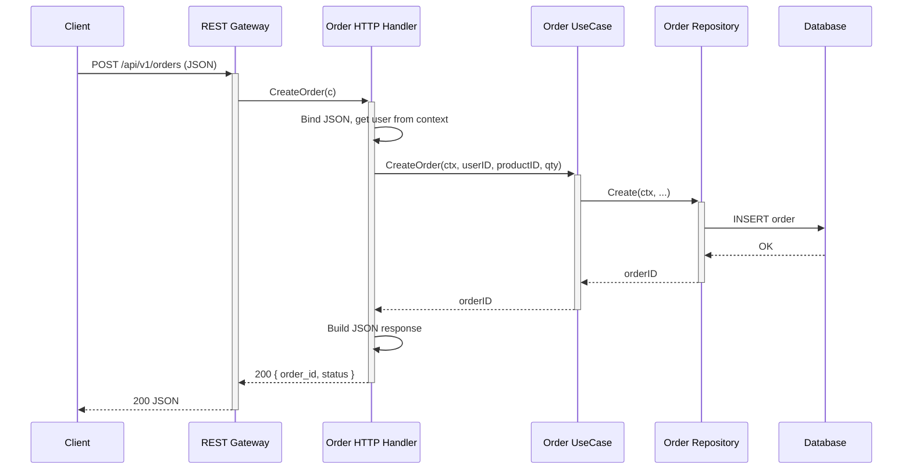
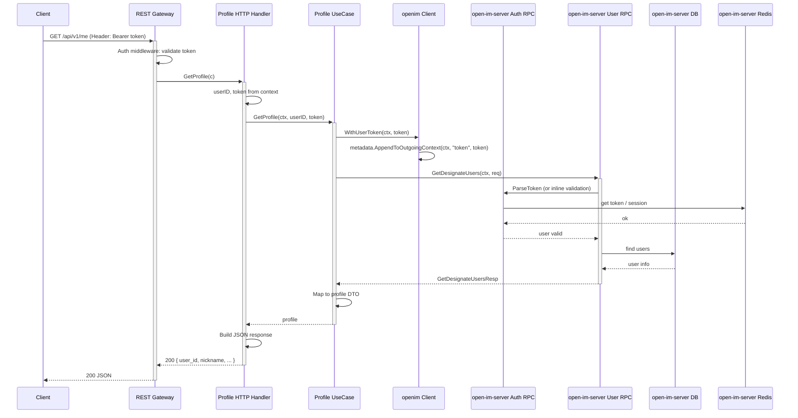

# Business Server & Proto — Developer Guide

This guide describes how to build and operate **our-business-server** (your business logic) and **our-proto** (your single source of truth for gRPC contracts), and how they integrate with **open-im-server** (your forked IM infrastructure). All three repos work together: **our-proto** defines every gRPC contract; **open-im-server** and **our-business-server** consume it and talk to each other via gRPC.

---

## Table of Contents

1. [Repo Structure](#1-repo-structure)
2. [our-proto — The Source of Truth](#2-our-proto--the-source-of-truth)
3. [Defining & Implementing a New Business Service](#3-defining--implementing-a-new-business-service)
4. [Calling open-im-server from our-business-server via gRPC](#4-calling-open-im-server-from-our-business-server-via-grpc)
5. [Service Discovery & Config](#5-service-discovery--config)
6. [Service-to-Service Communication (within our-business-server)](#6-service-to-service-communication-within-our-business-server)
7. [HTTP/REST Gateway](#7-httprest-gateway)
8. [Middleware & Cross-cutting Concerns](#8-middleware--cross-cutting-concerns)
9. [Error Handling Strategy](#9-error-handling-strategy)
10. [Workflow — Adding a New Feature End to End](#10-workflow--adding-a-new-feature-end-to-end)
11. [Mermaid Sequence Diagrams](#11-mermaid-sequence-diagrams)

---

## 1. Repo Structure

### 1.1 Recommended directory structure for `our-business-server`

Follow a clean, layered layout: entrypoints, transport (gRPC/HTTP), application (handlers/use cases), and domain/infrastructure.

```text
our-business-server/
├── cmd/
│   ├── gateway/                 # REST + gRPC gateway (single entrypoint or split)
│   │   └── main.go
│   └── grpc-server/             # Optional: dedicated gRPC-only server
│       └── main.go
├── internal/
│   ├── gateway/                 # HTTP/REST gateway (Gin, routes, middleware)
│   │   ├── router.go
│   │   ├── middleware/
│   │   └── handler/              # HTTP handlers that delegate to use cases
│   ├── grpc/                    # gRPC server and registration
│   │   ├── server.go
│   │   └── register.go
│   ├── service/                 # Business services (handlers + use cases)
│   │   ├── orders/
│   │   │   ├── handler.go       # gRPC method implementations
│   │   │   ├── usecase.go       # Business logic (or "application" layer)
│   │   │   └── repository.go    # Interface + implementation
│   │   └── notifications/
│   │       ├── handler.go
│   │       └── usecase.go
│   ├── client/                  # Outbound gRPC clients (open-im-server, etc.)
│   │   ├── openim/
│   │   │   ├── client.go        # Connection + client wrappers
│   │   │   ├── auth.go
│   │   │   └── user.go
│   │   └── discovery.go         # Optional: etcd-based discovery for open-im
│   └── config/
│       ├── config.go            # Config structs
│       └── load.go              # Load from env/files
├── pkg/                         # Shared, non-business packages (optional)
│   ├── errors/
│   ├── logger/
│   └── grpcutil/
├── config/                      # Config files (YAML/env)
│   ├── config.yaml
│   └── config.local.yaml
├── go.mod
└── go.sum
```

- **cmd/** — Entrypoints only; parse flags, load config, wire and run the gateway or gRPC server.
- **internal/gateway/** — REST routes and middleware; handlers call into **internal/service/** use cases.
- **internal/grpc/** — gRPC server setup and registration of service handlers.
- **internal/service/<name>/** — One package per business service: **handler** (gRPC), **usecase** (orchestration), **repository** (persistence/outbound).
- **internal/client/** — gRPC clients to open-im-server (and any other external services).
- **internal/config/** — Config structs and loading.

### 1.2 Recommended directory structure for `our-proto`

Keep OpenIM-origin protos and your own protos clearly separated; use a consistent `go_package` scheme so both open-im-server and our-business-server can import the same module.

```text
our-proto/
├── openim/                      # Original OpenIM protos (from openimsdk/protocol)
│   ├── auth/
│   │   └── auth.pb.go           # Generated (if you commit them)
│   ├── user/
│   ├── msg/
│   ├── conversation/
│   ├── group/
│   ├── relation/
│   ├── third/
│   └── ...
├── business/                    # Our own business service protos
│   ├── v1/
│   │   ├── order/
│   │   │   ├── order.proto
│   │   │   ├── order.pb.go
│   │   │   └── order_grpc.pb.go
│   │   └── notification/
│   │       ├── notification.proto
│   │       └── ...
│   └── common/
│       └── errors.proto         # Shared error codes / details
├── buf.gen.yaml                 # Optional: buf codegen config
├── Makefile                     # protoc / buf generate
├── go.mod                       # go_package = our-proto module path
└── README.md
```

**Naming and versioning:**

- **OpenIM:** Keep paths and package names compatible with upstream (e.g. `openim.auth`, `openim.user`) so open-im-server can consume with minimal changes.
- **Business:** Use a dedicated prefix and optional version, e.g. `business.v1.order`, `go_package` like `github.com/yourorg/our-proto/gen/go/business/v1/order;order`.
- **Versioning:** Use a **Go module** at repo root (e.g. `github.com/yourorg/our-proto/v2`). Tag releases (e.g. `v1.2.0`) so both open-im-server and our-business-server depend on a specific version.

### 1.3 Where to put what in `our-business-server`

| Concern | Location |
|--------|----------|
| **Services** | `internal/service/<name>/` (handler + usecase + repository) |
| **Handlers** | `internal/service/<name>/handler.go` (gRPC), `internal/gateway/handler/` (REST adapters) |
| **Proto files** | Only in **our-proto**; never in our-business-server |
| **Config** | `internal/config/` (structs), `config/*.yaml` or env |
| **Middleware** | `internal/gateway/middleware/` (auth, logging, rate limit) |
| **OpenIM client** | `internal/client/openim/` |
| **gRPC server bootstrap** | `internal/grpc/server.go`, `register.go` |

---

## 2. our-proto — The Source of Truth

### 2.1 Why our-proto owns ALL contracts

- **Single source of truth:** Every gRPC service and message used by open-im-server and our-business-server is defined in our-proto. No duplicate `.proto` files in either consumer.
- **We own it:** We can add, modify, and extend definitions (new services, new RPCs on existing services, new messages) without depending on upstream release cycles.
- **Consistency:** Both servers import the same Go package for a given service; no version skew or re-definition of messages.

### 2.2 Adding a brand new proto file for a new business service

Create a new directory and `.proto` file under your business namespace (e.g. `business/v1/order`).

**File: `our-proto/business/v1/order/order.proto`**

```protobuf
syntax = "proto3";

package business.v1.order;

option go_package = "github.com/yourorg/our-proto/gen/go/business/v1/order;order";

service OrderService {
  rpc CreateOrder(CreateOrderRequest) returns (CreateOrderResponse);
  rpc GetOrder(GetOrderRequest) returns (GetOrderResponse);
}

message CreateOrderRequest {
  string user_id = 1;
  string product_id = 2;
  int32 quantity = 3;
}

message CreateOrderResponse {
  string order_id = 1;
  string status = 2;
}

message GetOrderRequest {
  string order_id = 1;
}

message GetOrderResponse {
  string order_id = 1;
  string user_id = 2;
  string status = 3;
}
```

Then run your codegen (see §2.5) so that `gen/go/business/v1/order/` (or your chosen output path) contains `order.pb.go` and `order_grpc.pb.go`.

### 2.3 Extending an existing OpenIM proto (new RPC methods)

To add a new RPC to an existing OpenIM service (e.g. `user.UserService`), edit the corresponding proto in our-proto (e.g. under `openim/user/user.proto` or wherever you mirror upstream).

**Example: add `GetUserPreferences` to the user service**

```protobuf
// In our-proto/openim/user/user.proto (or your mirror path)

service User {
  // ... existing rpcs ...
  rpc GetUserPreferences(GetUserPreferencesRequest) returns (GetUserPreferencesResponse);
}

message GetUserPreferencesRequest {
  string user_id = 1;
}

message GetUserPreferencesResponse {
  string theme = 1;
  bool notifications_enabled = 2;
}
```

After codegen, open-im-server and our-business-server both get the new method. Implement it in open-im-server’s user RPC; our-business-server can call it via the same generated client.

### 2.4 Running protoc / code generation and where generated Go goes

**Option A — Generate inside our-proto and commit:**

- Run `protoc` (or `buf generate`) inside our-proto with `--go_out` and `--go-grpc_out` pointing to a directory like `gen/go/`.
- Commit the generated `*.pb.go` and `*_grpc.pb.go` files so consumers only need to `go get github.com/yourorg/our-proto@vx.y.z`.

**Option B — Generate at build time in each consumer:**

- our-proto holds only `.proto` files. Each repo (open-im-server, our-business-server) runs a Makefile/target that runs `protoc` with the same `go_package` and outputs into their own repo (e.g. `internal/pb/` or `pkg/pb/`). Less common when you want a single shared module.

**Recommended:** Generate inside our-proto and commit generated Go so that:

- `our-proto` has a Go module at the repo root (or under `gen/go/`).
- `go.mod` in our-proto: `module github.com/yourorg/our-proto`.
- Import path example: `github.com/yourorg/our-proto/gen/go/business/v1/order`.
- Both open-im-server and our-business-server do: `go get github.com/yourorg/our-proto@v1.2.0`.

**Example Makefile target (our-proto):**

```makefile
# our-proto/Makefile
PROTO_DIRS := openim business
PROTO_FILES := $(shell find $(PROTO_DIRS) -name '*.proto')
GEN_GO := gen/go

generate:
	@for f in $(PROTO_FILES); do \
		protoc --go_out=$(GEN_GO) --go_opt=paths=source_relative \
			--go-grpc_out=$(GEN_GO) --go-grpc_opt=paths=source_relative \
			-I . $$f; \
	done
```

### 2.5 How consumers import our-proto as a Go module

- **our-business-server/go.mod:**

```go
module github.com/yourorg/our-business-server

require (
	github.com/yourorg/our-proto v1.2.0
	google.golang.org/grpc v1.60.0
	// ...
)
```

- **open-im-server (forked) go.mod:** Replace or require the upstream protocol with our-proto:

```go
require (
	github.com/openimsdk/protocol v0.0.0
	// ...
)
replace github.com/openimsdk/protocol => github.com/yourorg/our-proto v1.2.0
```

In code:

```go
// In our-business-server
import (
	orderpb "github.com/yourorg/our-proto/gen/go/business/v1/order"
	authpb "github.com/yourorg/our-proto/openim/auth"  // or your actual path
)
```

### 2.6 Versioning strategy

- **Proto files:** Use a version in the path or package (e.g. `business/v1/`) so you can add `v2` later without breaking v1.
- **Go module:** Tag our-proto with semver (`v1.2.0`). Bump minor for new RPCs/messages, major for breaking changes.
- **Consumers:** Pin a specific version in `go.mod` and update explicitly after pulling new proto changes and regenerating.

---

## 3. Defining & Implementing a New Business Service (our-business-server)

### 3.1 Define the proto in our-proto

Already covered in §2.2: add e.g. `business/v1/order/order.proto`, run codegen, tag our-proto, and in our-business-server run `go get github.com/yourorg/our-proto@v1.2.0`.

### 3.2 Implement the generated gRPC server interface

Implement the interface generated from that proto (e.g. `order.OrderServiceServer`) in a handler that delegates to a use case.

**File: `internal/service/order/handler.go`**

```go
package order

import (
	"context"

	orderpb "github.com/yourorg/our-proto/gen/go/business/v1/order"
	"google.golang.org/grpc/codes"
	"google.golang.org/grpc/status"
)

// Ensure we implement the generated interface.
var _ orderpb.OrderServiceServer = (*Handler)(nil)

type Handler struct {
	orderpb.UnimplementedOrderServiceServer
	uc *UseCase
}

func NewHandler(uc *UseCase) *Handler {
	return &Handler{uc: uc}
}

func (h *Handler) CreateOrder(ctx context.Context, req *orderpb.CreateOrderRequest) (*orderpb.CreateOrderResponse, error) {
	if req == nil || req.UserId == "" || req.ProductId == "" {
		return nil, status.Error(codes.InvalidArgument, "user_id and product_id required")
	}
	orderID, err := h.uc.CreateOrder(ctx, req.UserId, req.ProductId, int(req.Quantity))
	if err != nil {
		return nil, err // or map to gRPC status (see §9)
	}
	return &orderpb.CreateOrderResponse{
		OrderId: orderID,
		Status:  "created",
	}, nil
}

func (h *Handler) GetOrder(ctx context.Context, req *orderpb.GetOrderRequest) (*orderpb.GetOrderResponse, error) {
	if req == nil || req.OrderId == "" {
		return nil, status.Error(codes.InvalidArgument, "order_id required")
	}
	o, err := h.uc.GetOrder(ctx, req.OrderId)
	if err != nil {
		return nil, err
	}
	return &orderpb.GetOrderResponse{
		OrderId: o.ID,
		UserId:  o.UserID,
		Status:  o.Status,
	}, nil
}
```

### 3.3 Bootstrap and serve the gRPC server

Create a gRPC server, register your handlers, and listen. Keep main thin: load config, build dependencies, then run.

**File: `internal/grpc/server.go`**

```go
package grpc

import (
	"fmt"
	"net"

	orderpb "github.com/yourorg/our-proto/gen/go/business/v1/order"
	"github.com/yourorg/our-business-server/internal/service/order"
	"google.golang.org/grpc"
	"google.golang.org/grpc/health"
	healthpb "google.golang.org/grpc/health/grpc_health_v1"
	"google.golang.org/grpc/reflection"
)

type Server struct {
	grpcServer *grpc.Server
	listener   net.Listener
}

func NewServer(orderHandler *order.Handler) (*Server, error) {
	grpcServer := grpc.NewServer(
		// Add unary/stream interceptors for auth, logging, recovery
	)
	orderpb.RegisterOrderServiceServer(grpcServer, orderHandler)
	healthpb.RegisterHealthServer(grpcServer, health.NewServer())
	reflection.Register(grpcServer)

	listener, err := net.Listen("tcp", ":9090")
	if err != nil {
		return nil, fmt.Errorf("listen: %w", err)
	}
	return &Server{grpcServer: grpcServer, listener: listener}, nil
}

func (s *Server) Serve() error {
	return s.grpcServer.Serve(s.listener)
}

func (s *Server) GracefulStop() {
	s.grpcServer.GracefulStop()
}
```

**File: `cmd/gateway/main.go` (or `cmd/grpc-server/main.go`)**

```go
package main

import (
	"context"
	"os"
	"os/signal"
	"syscall"

	"github.com/yourorg/our-business-server/internal/config"
	"github.com/yourorg/our-business-server/internal/grpc"
	"github.com/yourorg/our-business-server/internal/service/order"
)

func main() {
	cfg, err := config.Load()
	if err != nil {
		panic(err)
	}
	ctx, cancel := context.WithCancel(context.Background())
	defer cancel()

	// Build use case and handler (inject repo, openim client, etc.)
	orderUC := order.NewUseCase(/* repo, openimClient */)
	orderHandler := order.NewHandler(orderUC)

	srv, err := grpc.NewServer(orderHandler)
	if err != nil {
		panic(err)
	}
	go func() {
		_ = srv.Serve()
	}()

	quit := make(chan os.Signal, 1)
	signal.Notify(quit, syscall.SIGINT, syscall.SIGTERM)
	<-quit
	srv.GracefulStop()
}
```

### 3.4 Structuring handler / usecase / repository

- **Handler:** Only gRPC: parse request, call use case, map result/error to proto response and gRPC status.
- **UseCase:** Pure business logic: orchestrate repository and external clients (e.g. open-im-server); no proto types in signatures if you prefer (use domain types and convert at the handler).
- **Repository:** Interface in the service package, implementation in `internal/repository/` or next to the use case; talks to DB or other storage.

**Example use case and repository interface:**

**File: `internal/service/order/usecase.go`**

```go
package order

import (
	"context"
)

type Order struct {
	ID       string
	UserID   string
	ProductID string
	Quantity int
	Status   string
}

type Repository interface {
	Create(ctx context.Context, userID, productID string, quantity int) (orderID string, err error)
	GetByID(ctx context.Context, orderID string) (*Order, error)
}

type UseCase struct {
	repo Repository
	// openimClient openim.Client // inject if needed
}

func NewUseCase(repo Repository) *UseCase {
	return &UseCase{repo: repo}
}

func (uc *UseCase) CreateOrder(ctx context.Context, userID, productID string, quantity int) (string, error) {
	return uc.repo.Create(ctx, userID, productID, quantity)
}

func (uc *UseCase) GetOrder(ctx context.Context, orderID string) (*Order, error) {
	return uc.repo.GetByID(ctx, orderID)
}
```

---

## 4. Calling open-im-server from our-business-server via gRPC

### 4.1 Set up a gRPC client in our-business-server

Because both repos consume **our-proto**, you use the same generated client types (e.g. `auth.NewAuthClient(cc)`, `user.NewUserClient(cc)`). Create one or more connections and wrap them in a small client struct for dependency injection.

**File: `internal/client/openim/client.go`**

```go
package openim

import (
	"context"
	"fmt"
	"sync"

	authpb "github.com/yourorg/our-proto/openim/auth"   // adjust path to your our-proto layout
	userpb "github.com/yourorg/our-proto/openim/user"
	"google.golang.org/grpc"
	"google.golang.org/grpc/credentials/insecure"
)

type Config struct {
	AuthRPCAddr string // e.g. "localhost:10003" or discovery key
	UserRPCAddr string
}

type Client struct {
	authClient authpb.AuthClient
	userClient userpb.UserClient
	connAuth   *grpc.ClientConn
	connUser   *grpc.ClientConn
}

func New(ctx context.Context, cfg Config) (*Client, error) {
	opts := []grpc.DialOption{
		grpc.WithTransportCredentials(insecure.NewCredentials()),
		grpc.WithDefaultCallOptions(grpc.MaxCallRecvMsgSize(20 << 20)),
	}
	connAuth, err := grpc.DialContext(ctx, cfg.AuthRPCAddr, opts...)
	if err != nil {
		return nil, fmt.Errorf("dial auth: %w", err)
	}
	connUser, err := grpc.DialContext(ctx, cfg.UserRPCAddr, opts...)
	if err != nil {
		_ = connAuth.Close()
		return nil, fmt.Errorf("dial user: %w", err)
	}
	return &Client{
		authClient: authpb.NewAuthClient(connAuth),
		userClient: userpb.NewUserClient(connUser),
		connAuth:   connAuth,
		connUser:   connUser,
	}, nil
}

func (c *Client) Auth() authpb.AuthClient { return c.authClient }
func (c *Client) User() userpb.UserClient { return c.userClient }

func (c *Client) Close() error {
	var err1, err2 error
	if c.connAuth != nil {
		err1 = c.connAuth.Close()
	}
	if c.connUser != nil {
		err2 = c.connUser.Close()
	}
	if err1 != nil {
		return err1
	}
	return err2
}
```

### 4.2 Reusing generated pb files (no duplication)

Both open-im-server and our-business-server depend on **our-proto** as a Go module. There is no duplication: each repo has a single dependency on `github.com/yourorg/our-proto`. You import the same packages (e.g. `our-proto/openim/auth`) for client and server stubs and message types.

### 4.3 Auth / tokens when calling open-im-server

OpenIM expects an admin or user token in gRPC metadata. Attach it to the context before calling.

**Admin token (e.g. for server-side operations):**

```go
// Obtain once at startup or from config/env, then reuse.
func (c *Client) WithAdminToken(ctx context.Context) (context.Context, error) {
	token, err := c.authClient.GetAdminToken(ctx, &authpb.GetAdminTokenReq{
		Secret: c.adminSecret, // from config
	})
	if err != nil {
		return nil, err
	}
	return metadata.AppendToOutgoingContext(ctx, "token", token.Token), nil
}
```

**User token (forward from REST/gRPC request):**

```go
// When your gateway receives a request with a user token, pass it through.
func (c *Client) WithUserToken(ctx context.Context, token string) context.Context {
	return metadata.AppendToOutgoingContext(ctx, "token", token)
}

// In your handler:
ctx = openimClient.WithUserToken(ctx, userTokenFromRequest)
resp, err := openimClient.User().GetDesignateUsers(ctx, req)
```

OpenIM’s auth RPC validates the token; use the same metadata key (e.g. `token`) that open-im-server expects (see open-im-server’s auth middleware).

### 4.4 Connection pooling, timeouts, retries

- **Pooling:** One `*grpc.ClientConn` per target address is the standard; gRPC multiplexes multiple RPCs over it. Reuse the same `Client` (and conns) across requests.
- **Timeouts:** Set per-call with `context.WithTimeout`:

```go
ctx, cancel := context.WithTimeout(ctx, 10*time.Second)
defer cancel()
resp, err := c.userClient.GetDesignateUsers(ctx, req)
```

- **Retries:** Use `google.golang.org/grpc/retry` or implement a simple backoff in your use case. Prefer retrying only on transient failures (e.g. `Unavailable`, `ResourceExhausted`).

```go
import "google.golang.org/grpc/retry"

opts := []grpc.DialOption{
	grpc.WithTransportCredentials(insecure.NewCredentials()),
	grpc.WithUnaryInterceptor(retry.UnaryClientInterceptor(retry.WithMax(3))),
}
```

### 4.5 Error handling and mapping open-im-server errors

OpenIM returns gRPC status with codes and possibly a structured detail. Map them to your domain or return a wrapped gRPC status.

```go
import (
	"google.golang.org/grpc/codes"
	"google.golang.org/grpc/status"
)

func mapOpenIMError(err error) error {
	if err == nil {
		return nil
	}
	st, ok := status.FromError(err)
	if !ok {
		return err
	}
	switch st.Code() {
	case codes.NotFound:
		return ErrUserNotFound
	case codes.PermissionDenied:
		return ErrUnauthorized
	case codes.ResourceExhausted:
		return ErrRateLimited
	default:
		return err
	}
}
```

Use this in your use case or handler when calling open-im-server and before returning to the client.

---

## 5. Service Discovery & Config

### 5.1 How open-im-server uses etcd; should our-business-server use it?

**open-im-server:** Registers its RPC endpoints in etcd (or Kubernetes) and discovers other internal services via the same registry (see `pkg/common/discovery/discoveryregister.go`). It uses service names (e.g. `user-rpc-service`, `auth-rpc-service`) from config.

**our-business-server:** You have two options:

- **Static endpoints (recommended for simplicity):** In config, set the addresses of open-im-server’s RPCs (e.g. `auth_rpc_addr: "openim-rpc-auth:10003"`). No etcd dependency in our-business-server. Easiest for local and many deployments.
- **Use etcd (or same discovery):** If you run in the same cluster and want to resolve open-im-server by the same names, create a small discovery client that uses the same etcd root and service names as open-im-server, then `GetConn(serviceName)` and pass the connection to your openim client. Only needed if endpoints change often or you scale open-im-server dynamically.

**Example static config:**

```yaml
# config/config.yaml
openim:
  auth_rpc_addr: "localhost:10003"
  user_rpc_addr: "localhost:10004"
  # or in k8s: openim-rpc-auth:10003
```

### 5.2 Environment-based config (local, staging, prod)

Use a single config struct and load from file + env overlay.

**File: `internal/config/config.go`**

```go
package config

import (
	"os"

	"gopkg.in/yaml.v3"
)

type Config struct {
	Env     string `yaml:"env"`      // local, staging, prod
	Gateway struct {
		HTTPAddr string `yaml:"http_addr"`
		GRPCAddr string `yaml:"grpc_addr"`
	} `yaml:"gateway"`
	OpenIM struct {
		AuthRPCAddr string `yaml:"auth_rpc_addr"`
		UserRPCAddr string `yaml:"user_rpc_addr"`
	} `yaml:"openim"`
	JWT struct {
		Secret     string `yaml:"secret"`
		ExpireSecs int    `yaml:"expire_secs"`
	} `yaml:"jwt"`
}

func Load() (*Config, error) {
	path := os.Getenv("CONFIG_PATH")
	if path == "" {
		path = "config/config.yaml"
	}
	data, err := os.ReadFile(path)
	if err != nil {
		return nil, err
	}
	var cfg Config
	if err := yaml.Unmarshal(data, &cfg); err != nil {
		return nil, err
	}
	// Env overrides (e.g. CONFIG_OPENIM_AUTH_RPC_ADDR)
	if v := os.Getenv("CONFIG_OPENIM_AUTH_RPC_ADDR"); v != "" {
		cfg.OpenIM.AuthRPCAddr = v
	}
	if v := os.Getenv("CONFIG_OPENIM_USER_RPC_ADDR"); v != "" {
		cfg.OpenIM.UserRPCAddr = v
	}
	return &cfg, nil
}
```

### 5.3 Configuring which open-im-server gRPC endpoints to call

Store addresses in config (as above) and pass them into `internal/client/openim.New(ctx, openim.Config{...})`. Use different YAML files or env vars per environment (e.g. `config/config.prod.yaml`, `CONFIG_OPENIM_AUTH_RPC_ADDR=openim-rpc-auth:10003`).

---

## 6. Service-to-Service Communication (within our-business-server)

### 6.1 Internal services calling each other via gRPC (our-proto contracts)

If you run multiple gRPC services in our-business-server (e.g. gateway + order service + notification service), they can call each other using the same our-proto generated clients. Options:

- **In-process:** Pass the same `*grpc.Server` and register all services; for “calls” between them, invoke the use case directly (no network). No proto needed for internal-only calls if you prefer.
- **Same process, gRPC:** Create a local client connection to the same server (e.g. `grpc.Dial("passthrough:///localhost:9090", ...)`) and use the generated client. Useful if you want a single transport and consistent semantics.
- **Different processes:** Use real addresses (or discovery) and dial; same as calling open-im-server but for your own services.

**Example: in-process direct call (recommended when in same binary):**

```go
// In cmd/gateway/main.go you have both orderUC and notificationUC.
// Instead of orderUC calling notificationUC via gRPC, inject notificationUC into orderUC and call a method.
type OrderUseCase struct {
	repo            order.Repository
	notificationUC  *notification.UseCase
}

func (uc *OrderUseCase) CreateOrder(ctx context.Context, ...) (string, error) {
	orderID, err := uc.repo.Create(ctx, ...)
	if err != nil {
		return "", err
	}
	_ = uc.notificationUC.OrderCreated(ctx, orderID, userID) // in-process, no gRPC
	return orderID, nil
}
```

### 6.2 When to use gRPC vs in-process calls

- **gRPC between our services:** Use when services run in separate processes or you want strict API boundaries and independent deployment.
- **In-process (function call):** Use when both “services” live in the same binary; avoids serialization and network. Prefer this for a monolith gateway that hosts all handlers.

### 6.3 Avoiding unnecessary network hops

Keep the gateway and all business handlers in one process and call use cases directly. Only use gRPC for external boundaries (clients, open-im-server, or other microservices). If you later split a service into another pod, then introduce gRPC (or REST) between them and use our-proto for the contract.

---

## 7. HTTP/REST Gateway

### 7.1 Exposing business services via REST

Add an HTTP layer (e.g. Gin) that receives REST requests, parses JSON, calls the same use cases your gRPC handlers use, and returns JSON. No need to expose gRPC directly to the frontend unless you want to.

**File: `internal/gateway/router.go`**

```go
package gateway

import (
	"github.com/gin-gonic/gin"
	"github.com/yourorg/our-business-server/internal/gateway/middleware"
	orderhandler "github.com/yourorg/our-business-server/internal/gateway/handler/order"
)

func NewRouter(orderHandler *orderhandler.HTTPHandler) *gin.Engine {
	r := gin.New()
	r.Use(middleware.Logger(), middleware.Recovery(), middleware.Auth())
	api := r.Group("/api/v1")
	{
		api.POST("/orders", orderHandler.CreateOrder)
		api.GET("/orders/:id", orderHandler.GetOrder)
	}
	return r
}
```

**File: `internal/gateway/handler/order/http.go`**

```go
package order

import (
	"net/http"

	"github.com/gin-gonic/gin"
	"github.com/yourorg/our-business-server/internal/service/order"
)

type HTTPHandler struct {
	uc *order.UseCase
}

func NewHTTPHandler(uc *order.UseCase) *HTTPHandler {
	return &HTTPHandler{uc: uc}
}

type CreateOrderBody struct {
	UserID    string `json:"user_id" binding:"required"`
	ProductID string `json:"product_id" binding:"required"`
	Quantity  int    `json:"quantity"`
}

func (h *HTTPHandler) CreateOrder(c *gin.Context) {
	var body CreateOrderBody
	if err := c.ShouldBindJSON(&body); err != nil {
		c.JSON(http.StatusBadRequest, gin.H{"error": err.Error()})
		return
	}
	orderID, err := h.uc.CreateOrder(c.Request.Context(), body.UserID, body.ProductID, body.Quantity)
	if err != nil {
		c.JSON(http.StatusInternalServerError, gin.H{"error": err.Error()})
		return
	}
	c.JSON(http.StatusOK, gin.H{"order_id": orderID, "status": "created"})
}

func (h *HTTPHandler) GetOrder(c *gin.Context) {
	id := c.Param("id")
	if id == "" {
		c.JSON(http.StatusBadRequest, gin.H{"error": "id required"})
		return
	}
	o, err := h.uc.GetOrder(c.Request.Context(), id)
	if err != nil {
		c.JSON(http.StatusNotFound, gin.H{"error": err.Error()})
		return
	}
	c.JSON(http.StatusOK, gin.H{"order_id": o.ID, "user_id": o.UserID, "status": o.Status})
}
```

### 7.2 Gateway that routes REST → internal gRPC

You have two patterns:

- **REST → use case directly (recommended):** As above; HTTP handler calls the same use case the gRPC handler uses. No internal gRPC call from gateway to “order service” if they’re in the same process.
- **REST → gRPC to your own service:** If the order service is a separate process, run a small HTTP→gRPC proxy (e.g. grpc-gateway with your proto, or a thin Gin handler that builds a proto request, calls the generated client, and maps the response to JSON). grpc-gateway generates a reverse-proxy from your proto; you run it and point it at your gRPC server.

**Recommended:** Start with REST handlers calling use cases directly. Add grpc-gateway only if you want a single proto-driven REST API that mirrors your gRPC 1:1.

---

## 8. Middleware & Cross-cutting Concerns

### 8.1 Auth middleware (JWT validation, token forwarding)

Validate JWT (or session) and attach user ID to context; optionally call open-im-server to parse/validate the token and get user info.

**File: `internal/gateway/middleware/auth.go`**

```go
package middleware

import (
	"net/http"
	"strings"

	"github.com/gin-gonic/gin"
)

const ContextUserID = "user_id"
const ContextToken = "token"

func Auth() gin.HandlerFunc {
	return func(c *gin.Context) {
		authHeader := c.GetHeader("Authorization")
		if authHeader == "" {
			c.AbortWithStatusJSON(http.StatusUnauthorized, gin.H{"error": "missing Authorization"})
			return
		}
		const prefix = "Bearer "
		if !strings.HasPrefix(authHeader, prefix) {
			c.AbortWithStatusJSON(http.StatusUnauthorized, gin.H{"error": "invalid Authorization"})
			return
		}
		token := strings.TrimPrefix(authHeader, prefix)
		// Option A: validate JWT locally (e.g. jwt.Parse, check claims).
		// Option B: call open-im-server auth.ParseToken and get user_id from response.
		userID := validateTokenAndGetUserID(c.Request.Context(), token) // implement or inject
		if userID == "" {
			c.AbortWithStatusJSON(http.StatusUnauthorized, gin.H{"error": "invalid token"})
			return
		}
		c.Set(ContextUserID, userID)
		c.Set(ContextToken, token)
		c.Next()
	}
}
```

When calling open-im-server from a use case, pass the token from context: `ctx = openim.WithUserToken(ctx, token)`.

### 8.2 Logging, tracing, and metrics

- **Logging:** Use a structured logger (e.g. zap, zerolog). Add a middleware that logs method, path, status, duration, and request ID (from header or generated).
- **Tracing:** Inject a trace ID in middleware and pass it in context; use OpenTelemetry or similar to propagate to open-im-server (gRPC metadata). Record spans in gateway and in use cases.
- **Metrics:** Instrument HTTP (counter/latency by route) and gRPC client (calls, errors, latency by method). Expose `/metrics` for Prometheus.

**Example logging middleware:**

```go
import (
	"time"
	// e.g. "github.com/rs/zerolog/log"
)

func Logger() gin.HandlerFunc {
	return func(c *gin.Context) {
		start := time.Now()
		path := c.Request.URL.Path
		c.Next()
		latency := time.Since(start)
		log.Info().Str("path", path).Int("status", c.Writer.Status()).Dur("latency", latency).Msg("request")
	}
}
```

### 8.3 Rate limiting

Apply a rate limiter (e.g. per IP or per user_id from context) in gateway middleware. Use a token bucket or sliding window; store state in memory or Redis for multi-instance consistency.

```go
// import "golang.org/x/time/rate"
func RateLimit(limiter *rate.Limiter) gin.HandlerFunc {
	return func(c *gin.Context) {
		if !limiter.Allow() {
			c.AbortWithStatusJSON(http.StatusTooManyRequests, gin.H{"error": "rate limited"})
			return
		}
		c.Next()
	}
}
```

---

## 9. Error Handling Strategy

### 9.1 Defining our own error codes in our-proto

Add a small `errors.proto` or reuse a detail message for structured errors.

**File: `our-proto/business/common/errors.proto`**

```protobuf
syntax = "proto3";

package business.common;

option go_package = "github.com/yourorg/our-proto/gen/go/business/common;common";

message ErrorDetail {
  string code = 1;       // e.g. ORDER_NOT_FOUND, INVALID_QUANTITY
  string message = 2;
  string request_id = 3;
}
```

In gRPC handlers, return `status.Error` or `status.Proto` with this detail attached so clients can parse it.

### 9.2 Mapping open-im-server errors to our domain

Use a helper like in §4.5: `status.FromError(err)` and map `st.Code()` and optional details to your domain errors or to a standard REST/gRPC response. Centralize this in `pkg/errors` or `internal/client/openim`.

### 9.3 gRPC status code best practices

- Use `codes.InvalidArgument` for bad input, `codes.NotFound` for missing resources, `codes.PermissionDenied` for authz, `codes.Unauthenticated` for missing/invalid auth.
- Attach structured details (e.g. `ErrorDetail`) for machine-readable codes. Log full error server-side; avoid leaking internals in client-facing messages.

---

## 10. Workflow — Adding a New Feature End to End

### 1. Define the proto in our-proto

- Add e.g. `business/v1/feedback/feedback.proto` with `FeedbackService` and RPCs `SubmitFeedback`, `GetFeedback`.
- Run codegen in our-proto; commit generated Go; tag release (e.g. `v1.3.0`).

### 2. Run codegen

- In our-proto: `make generate` (or `buf generate`).
- In our-business-server: `go get github.com/yourorg/our-proto@v1.3.0`.

### 3. Implement the handler in our-business-server

- Add `internal/service/feedback/handler.go` implementing `feedback.FeedbackServiceServer`.
- Add `usecase.go` and optional `repository.go`; wire in `main.go` and register in `internal/grpc/server.go`.

### 4. Call open-im-server from that handler if needed

- In the use case, inject `internal/client/openim.Client` and call e.g. `openimClient.User().GetDesignateUsers(ctx, req)` after attaching token to `ctx`. Map errors with `mapOpenIMError`.

### 5. Expose via REST gateway

- Add `internal/gateway/handler/feedback/http.go` with `SubmitFeedback` and `GetFeedback` that bind JSON, call the same use case, return JSON.
- Register routes in `internal/gateway/router.go` and protect with auth middleware.

---

## 11. Mermaid Sequence Diagrams

The following two diagrams use **sequenceDiagram** format. Scenario 1: a pure business call that does **not** call open-im-server. Scenario 2: a business call that **does** call open-im-server, which in turn uses DB and Redis.

### Scenario 1: Pure business service (no open-im-server)



### Scenario 2: Business service calls open-im-server



---

**End of guide.** For open-im-server-specific details (adding RPCs, discovery, config), see [ADDING_A_SERVICE_DEVELOPER_GUIDE.md](ADDING_A_SERVICE_DEVELOPER_GUIDE.md) and [DEVELOPER.md](DEVELOPER.md).
