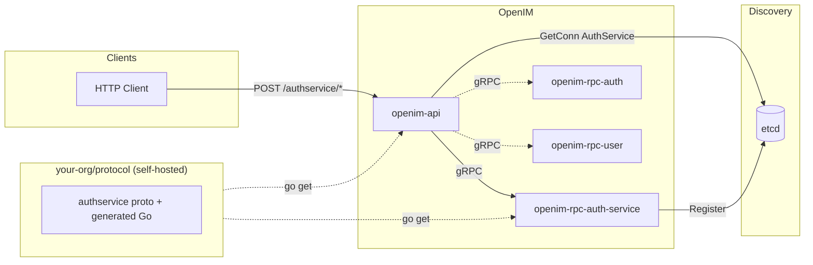

# Adding a New Microservice to OpenIM

This guide walks through adding a new RPC microservice to the OpenIM Server codebase. We use **auth-service** as the example (a hypothetical extra auth-related service). The same steps apply to any new service; substitute your service name where you see `auth-service` or `authservice`.

**Prerequisites:** OpenIM Server repo is already cloned. You are familiar with Go, gRPC, and the layout described in [DEVELOPER.md](../README.md) and [PROCESS_FLOW.md](../PROCESS_FLOW.md).

---

## Table of Contents

1. [Repository setup](#1-repository-setup)
2. [Forking and hosting the protocol repo](#2-forking-and-hosting-the-protocol-repo)
3. [Folder structure for the new service](#3-folder-structure-for-the-new-service)
4. [Creating a new protobuf file for the service](#4-creating-a-new-protobuf-file-for-the-service)
5. [Generating gRPC code from protobuf](#5-generating-grpc-code-from-protobuf)
6. [Implementing the RPC server](#6-implementing-the-rpc-server)
7. [Bootstrapping the service with main.go](#7-bootstrapping-the-service-with-maingo)
8. [Configuring service registration](#8-configuring-service-registration)
9. [Wiring requests from openim-api to the new service](#9-wiring-requests-from-openim-api-to-the-new-service)
10. [Integration boundaries](#10-integration-boundaries)
11. [Building and running the service](#11-building-and-running-the-service)
12. [Architecture with the new service](#12-architecture-with-the-new-service)

---

## 1. Repository setup

- **Assumption:** You already have `open-im-server` cloned.
- Ensure Go 1.22+ and dependencies are ready:

```bash
cd /path/to/open-im-server
go mod download
```

- All proto definitions live in your **self-hosted fork of openimsdk/protocol** (see [§2](#2-forking-and-hosting-the-protocol-repo)). This is the single source of truth for all service contracts. Do not add `.proto` files inside `open-im-server` — keep the server repo focused on implementation only.

---

## 2. Forking and hosting the protocol repo

> **This step is mandatory.** OpenIM uses the `openimsdk/protocol` repository as the canonical home for all `.proto` definitions and their generated Go code. Because you will need to add your own proto files, you must fork this repo and host it internally. This keeps all service contracts versioned in one place and decoupled from the server implementation.

### 2.1 Fork and mirror the protocol repo

1. Fork `https://github.com/openimsdk/protocol` to your internal Git host (GitHub Enterprise, GitLab, Gitea, Bitbucket, etc.).
2. Clone your fork locally:

```bash
git clone https://your-internal-host.com/your-org/protocol.git
cd protocol
```

3. Keep upstream changes flowing in by adding the original as a remote:

```bash
git remote add upstream https://github.com/openimsdk/protocol.git
git fetch upstream
```

To pull in upstream updates later:

```bash
git fetch upstream
git merge upstream/main
```

### 2.2 Configure Go to use your internal host

Because your fork is a private module, the Go toolchain must be told not to proxy or checksum it through the public Go infrastructure:

```bash
export GOPRIVATE=your-internal-host.com
```

Set this in your shell profile (`.bashrc`, `.zshrc`, etc.) and in your CI/CD environment so every developer and pipeline uses it consistently.

If your internal host uses self-signed TLS certificates, you may also need:

```bash
export GONOSUMCHECK=your-internal-host.com
export GONOSUMDB=your-internal-host.com
```

### 2.3 Point open-im-server at your fork

In `open-im-server/go.mod`, replace the upstream module path with your fork:

```
require your-internal-host.com/your-org/protocol v0.0.xx
```

If your internal fork keeps the same Go module path as the original (`github.com/openimsdk/protocol`), use a `replace` directive instead so you don't have to change every import:

```
replace github.com/openimsdk/protocol => your-internal-host.com/your-org/protocol v0.0.xx
```

Then run:

```bash
go mod tidy
```

### 2.4 Tagging releases

Every time you add or change a proto and regenerate Go code, tag a new version in your protocol fork and bump the version reference in `open-im-server/go.mod`:

```bash
# In your protocol fork
git tag v0.0.xx
git push origin v0.0.xx

# In open-im-server
go get your-internal-host.com/your-org/protocol@v0.0.xx
go mod tidy
```

This ensures reproducible builds and makes it clear which contract version each server version depends on.

---

## 3. Folder structure for the new service

OpenIM keeps each RPC binary under `cmd/openim-rpc/<binary-name>/` and the implementation under `internal/rpc/<short-name>/`.

For **auth-service**, use a hyphenated binary name and a short package name:

| Purpose              | Path (example for auth-service)        |
|----------------------|----------------------------------------|
| Entrypoint binary    | `cmd/openim-rpc/openim-rpc-auth-service/main.go` |
| RPC implementation   | `internal/rpc/authservice/` |

Convention:

- **cmd:** `cmd/openim-rpc/openim-rpc-<name>/main.go` — one directory per runnable; name matches the binary.
- **internal/rpc:** `internal/rpc/<shortname>/` — all Go code for that RPC (server, config, handlers). Use a short, lowercase name without hyphens for the package (e.g. `authservice`).

Example layout:

```text
open-im-server/
├── cmd/
│   ├── main.go                                    # all-in-one runner (optional integration)
│   └── openim-rpc/
│       ├── openim-rpc-auth/
│       ├── openim-rpc-user/
│       └── openim-rpc-auth-service/               # NEW
│           └── main.go
├── internal/
│   └── rpc/
│       ├── auth/
│       ├── user/
│       └── authservice/                            # NEW
│           ├── server.go                           # Start(), Config, server struct
│           └── auth_service.go                     # RPC method implementations
└── config/
    └── openim-rpc-auth-service.yml                 # NEW (see §8)
```

Create the directories:

```bash
mkdir -p cmd/openim-rpc/openim-rpc-auth-service
mkdir -p internal/rpc/authservice
```

---

## 4. Creating a new protobuf file for the service

> **All proto work happens in your self-hosted protocol fork** (see [§2](#2-forking-and-hosting-the-protocol-repo)), not inside `open-im-server`. This keeps service contracts decoupled from implementation and ensures the protocol repo remains the single source of truth.

### 4.1 Location and naming

Inside your protocol fork, create a new file for the service:

```
protocol/
└── authservice/
    └── auth_service.proto
```

Naming convention: `<service_name>.proto`; package and service name in PascalCase (e.g. `AuthService`).

### 4.2 Example proto

```protobuf
syntax = "proto3";

package openim.authservice;

option go_package = "your-internal-host.com/your-org/protocol/authservice;authservice";

// AuthService is a custom auth-related microservice.
service AuthService {
  // Echo is an example RPC.
  rpc Echo(EchoReq) returns (EchoResp);
  // GetConfig returns a simple config value.
  rpc GetConfig(GetConfigReq) returns (GetConfigResp);
}

message EchoReq {
  string message = 1;
}

message EchoResp {
  string message = 1;
}

message GetConfigReq {
  string key = 1;
}

message GetConfigResp {
  string value = 1;
}
```

Adjust `go_package` to match your internal module path. The generated Go code will be importable as `your-internal-host.com/your-org/protocol/authservice`.

---

## 5. Generating gRPC code from protobuf

### 5.1 Install protoc and plugins

```bash
# Install protoc (see https://grpc.io/docs/protoc-installation/)
# Install Go plugins
go install google.golang.org/protobuf/cmd/protoc-gen-go@latest
go install google.golang.org/grpc/cmd/protoc-gen-go-grpc@latest
```

OpenIM also documents a custom Protoc bundle: [docs/contrib/protoc-tools.md](contrib/protoc-tools.md). Use that if your fork inherits the protocol repo's existing generation scripts.

### 5.2 Run code generation in your protocol fork

From the root of your protocol fork:

```bash
protoc --go_out=. --go_opt=paths=source_relative \
  --go-grpc_out=. --go-grpc_opt=paths=source_relative \
  authservice/auth_service.proto
```

This generates `authservice/auth_service.pb.go` and `authservice/auth_service_grpc.pb.go` inside the protocol fork. Commit these generated files.

If the protocol repo already has a Makefile or generation script, run that instead so your new file is picked up automatically:

```bash
make proto   # or whatever the protocol repo's generation target is
```

### 5.3 Tag and publish

```bash
git add authservice/
git commit -m "feat: add AuthService proto and generated Go code"
git tag v0.0.xx
git push origin main v0.0.xx
```

### 5.4 Bump the version in open-im-server

```bash
cd /path/to/open-im-server
go get your-internal-host.com/your-org/protocol@v0.0.xx
go mod tidy
```

You can now import the generated client and server types in `open-im-server`:

```go
import pb "your-internal-host.com/your-org/protocol/authservice"
```

---

## 6. Implementing the RPC server

### 6.1 Location

- **Package:** `internal/rpc/authservice`
- **Files:** At least `server.go` (lifecycle and config) and `auth_service.go` (RPC handlers). Split further by concern as needed.

### 6.2 Config struct

Config must include at minimum: RPC ports, Discovery, and Share. Follow the same pattern as existing RPCs (e.g. `internal/rpc/auth/auth.go`):

```go
// internal/rpc/authservice/server.go
package authservice

import (
	"github.com/openimsdk/open-im-server/v3/pkg/common/config"
)

type Config struct {
	RpcConfig   config.AuthService   // Add AuthService type in pkg/common/config (see §7)
	Discovery   config.Discovery
	Share       config.Share
}
```

In `pkg/common/config` you must add:
1. A constant: `OpenIMRPCAuthServiceCfgFileName = "openim-rpc-auth-service.yml"`
2. A config type `AuthService` with fields `RPC`, `Prometheus`, `RateLimiter`, `CircuitBreaker` (same shape as existing RPC configs) and a method `GetConfigFileName() string` returning the constant above.

### 6.3 Server struct and Start

```go
// internal/rpc/authservice/server.go
package authservice

import (
	"context"

	pb "your-internal-host.com/your-org/protocol/authservice"
	"github.com/openimsdk/tools/discovery"
	"google.golang.org/grpc"
)

type authServiceServer struct {
	pb.UnimplementedAuthServiceServer
	config *Config
}

func Start(ctx context.Context, cfg *Config, client discovery.SvcDiscoveryRegistry, server grpc.ServiceRegistrar) error {
	s := &authServiceServer{config: cfg}
	pb.RegisterAuthServiceServer(server, s)
	return nil
}
```

### 6.4 Implementing RPC methods

```go
// internal/rpc/authservice/auth_service.go
package authservice

import (
	"context"

	pb "your-internal-host.com/your-org/protocol/authservice"
	"github.com/openimsdk/tools/errs"
)

func (s *authServiceServer) Echo(ctx context.Context, req *pb.EchoReq) (*pb.EchoResp, error) {
	if req == nil || req.Message == "" {
		return nil, errs.ErrArgs.WrapMsg("message required")
	}
	return &pb.EchoResp{Message: req.Message}, nil
}

func (s *authServiceServer) GetConfig(ctx context.Context, req *pb.GetConfigReq) (*pb.GetConfigResp, error) {
	return &pb.GetConfigResp{Value: "example-value"}, nil
}
```

Use `github.com/openimsdk/tools/errs` and `github.com/openimsdk/tools/log` for errors and logging. Avoid `panic` and the standard `log` package.

### 6.5 internal/logic/ (optional)

OpenIM does not always have a separate `internal/logic/` layer. Many RPCs implement logic directly in `internal/rpc/<service>/`. If you want a clear boundary you can add `internal/rpc/authservice/logic/` for pure business logic with no gRPC types, and have the RPC handlers call into it. For a small service, keeping handlers flat in `internal/rpc/authservice/` is acceptable and matches several existing OpenIM RPCs.

---

## 7. Bootstrapping the service with main.go

Each RPC binary is started by a **cobra** command that loads config, sets up discovery, and calls `startrpc.Start` with the service's `Start` function.

### 7.1 Command struct and config map

Follow the same pattern as `pkg/common/cmd/auth.go` or `user.go`:

- A `*RpcCmd` struct embeds `*RootCmd` and holds a config map and the service config struct.
- Config map keys are config file names; values are pointers to the corresponding config struct fields.

### 7.2 Example: auth-service RPC command

Create `pkg/common/cmd/auth_service_rpc.go`:

```go
package cmd

import (
	"context"

	"github.com/openimsdk/open-im-server/v3/internal/rpc/authservice"
	"github.com/openimsdk/open-im-server/v3/pkg/common/config"
	"github.com/openimsdk/open-im-server/v3/pkg/common/startrpc"
	"github.com/openimsdk/open-im-server/v3/version"
	"github.com/openimsdk/tools/system/program"
	"github.com/spf13/cobra"
)

type AuthServiceRpcCmd struct {
	*RootCmd
	ctx       context.Context
	configMap map[string]any
	svcConfig *authservice.Config
}

func NewAuthServiceRpcCmd() *AuthServiceRpcCmd {
	var svcConfig authservice.Config
	ret := &AuthServiceRpcCmd{svcConfig: &svcConfig}
	ret.configMap = map[string]any{
		config.OpenIMRPCAuthServiceCfgFileName: &svcConfig.RpcConfig,
		config.ShareFileName:                   &svcConfig.Share,
		config.DiscoveryConfigFilename:         &svcConfig.Discovery,
	}
	ret.RootCmd = NewRootCmd(program.GetProcessName(), WithConfigMap(ret.configMap))
	ret.ctx = context.WithValue(context.Background(), "version", version.Version)
	ret.Command.RunE = func(cmd *cobra.Command, args []string) error {
		return ret.runE()
	}
	return ret
}

func (a *AuthServiceRpcCmd) Exec() error {
	return a.Execute()
}

func (a *AuthServiceRpcCmd) runE() error {
	return startrpc.Start(a.ctx,
		&a.svcConfig.Discovery,
		&a.svcConfig.RpcConfig.CircuitBreaker,
		&a.svcConfig.RpcConfig.RateLimiter,
		&a.svcConfig.RpcConfig.Prometheus,
		a.svcConfig.RpcConfig.RPC.ListenIP,
		a.svcConfig.RpcConfig.RPC.RegisterIP,
		a.svcConfig.RpcConfig.RPC.AutoSetPorts,
		a.svcConfig.RpcConfig.RPC.Ports,
		a.Index(),
		a.svcConfig.Discovery.RpcService.AuthService,
		nil,
		a.svcConfig,
		[]string{
			a.svcConfig.RpcConfig.GetConfigFileName(),
			a.svcConfig.Share.GetConfigFileName(),
			a.svcConfig.Discovery.GetConfigFileName(),
		},
		nil,
		authservice.Start)
}
```

### 7.3 main.go for the binary

```go
// cmd/openim-rpc/openim-rpc-auth-service/main.go
package main

import (
	"github.com/openimsdk/open-im-server/v3/pkg/common/cmd"
	"github.com/openimsdk/tools/system/program"
)

func main() {
	if err := cmd.NewAuthServiceRpcCmd().Exec(); err != nil {
		program.ExitWithError(err)
	}
}
```

This follows the same pattern as `cmd/openim-rpc/openim-rpc-auth/main.go`.

---

## 8. Configuring service registration

### 8.1 RPC config file

Create `config/openim-rpc-auth-service.yml` (mirroring `openim-rpc-auth.yml`):

```yaml
rpc:
  registerIP:
  listenIP: 0.0.0.0
  autoSetPorts: true
  ports:

prometheus:
  enable: true
  ports:

ratelimiter:
  enable: false
  window: 20s
  bucket: 500
  cpuThreshold: 850

circuitBreaker:
  enable: false
  window: 5s
  bucket: 100
  success: 0.6
  request: 500
```

When `autoSetPorts` is true, the service picks a free port and registers it with etcd. For fixed ports set `autoSetPorts: false` and fill in `rpc.ports` and `prometheus.ports`.

### 8.2 Discovery config: RpcService name

In `config/discovery.yml`, add an entry for the new service under `rpcService`:

```yaml
rpcService:
  user: user-rpc-service
  friend: friend-rpc-service
  msg: msg-rpc-service
  push: push-rpc-service
  messageGateway: messagegateway-rpc-service
  group: group-rpc-service
  auth: auth-rpc-service
  conversation: conversation-rpc-service
  third: third-rpc-service
  authService: auth-service-rpc-service   # NEW
```

In `pkg/common/config/config.go`, extend `RpcService` and `GetServiceNames()`:

```go
type RpcService struct {
	// ... existing fields ...
	AuthService string `yaml:"authService"`
}

func (r *RpcService) GetServiceNames() []string {
	return []string{
		// ... existing names ...
		r.AuthService,
	}
}
```

### 8.3 start-config.yml (when using mage/gomake)

If you run services via the repo's start script or mage, add the new binary:

```yaml
serviceBinaries:
  openim-api: 1
  openim-rpc-auth: 1
  openim-rpc-auth-service: 1   # NEW
  # ...
```

---

## 9. Wiring requests from openim-api to the new service

### 9.1 Get a connection in the API router

In `internal/api/router.go`, in `newGinRouter`:

1. Get a connection to the new service using its discovery name:

```go
authServiceConn, err := client.GetConn(ctx, cfg.Discovery.RpcService.AuthService)
if err != nil {
	return nil, err
}
```

2. Create a gRPC client and an API wrapper:

```go
authServiceClient := pb.NewAuthServiceClient(authServiceConn)
authServiceApi := NewAuthServiceApi(authServiceClient)
```

### 9.2 Define the API handler type and routes

Create `internal/api/auth_service_api.go`:

```go
package api

import (
	"github.com/gin-gonic/gin"
	"github.com/openimsdk/tools/a2r"
	pb "your-internal-host.com/your-org/protocol/authservice"
)

type AuthServiceApi struct {
	Client pb.AuthServiceClient
}

func NewAuthServiceApi(client pb.AuthServiceClient) AuthServiceApi {
	return AuthServiceApi{Client: client}
}

func (o *AuthServiceApi) Echo(c *gin.Context) {
	a2r.Call(c, pb.AuthServiceClient.Echo, o.Client)
}

func (o *AuthServiceApi) GetConfig(c *gin.Context) {
	a2r.Call(c, pb.AuthServiceClient.GetConfig, o.Client)
}
```

`a2r.Call` maps the Gin context (JSON body and response) to the gRPC method.

### 9.3 Register routes

In `newGinRouter`, add a route group:

```go
authServiceGroup := r.Group("/authservice")
{
	authServiceGroup.POST("/echo", authServiceApi.Echo)
	authServiceGroup.POST("/get_config", authServiceApi.GetConfig)
}
```

Clients call `POST /authservice/echo` and `POST /authservice/get_config` with JSON bodies matching the proto request messages. If routes must be protected by token, apply the same auth middleware used by other protected route groups.

---

## 10. Integration boundaries

### 10.1 What NOT to edit (keep OpenIM core behavior)

- **Core message pipeline:** Do not change how messages flow from openim-rpc-msg → Kafka → openim-msgtransfer → Redis/Mongo/Push unless intentionally extending that pipeline.
- **Protocol and SDK contracts:** Do not change existing request/response types or RPC names in your protocol fork for existing services; that would break SDKs and existing clients.
- **Existing RPC implementations:** Do not modify the internal logic of auth, user, msg, group, friend, conversation, third, or push just to wire your service. Call your service from the API or from another RPC via discovery instead.
- **Discovery and config layout:** Add new entries (new service name, new config file) rather than renaming or removing existing ones.
- **Gateway and transfer:** Do not change openim-msggateway or openim-msgtransfer behavior unless you are using a supported extension point.

### 10.2 What is allowed

- **New RPC service:** Add new binaries under `cmd/openim-rpc/`, new packages under `internal/rpc/`, new config files under `config/`, and new discovery names.
- **New proto:** Add new `.proto` files or new methods in your self-hosted protocol fork, generate new Go code, tag a release, and bump the version in `open-im-server/go.mod`.
- **API wiring:** Add new routes and new gRPC clients in openim-api to call your RPC.
- **Config and discovery:** Add fields to `RpcService`, new config structs, and new YAML files for the new service.
- **Optional all-in-one runner:** If you use the single-binary runner in `cmd/main.go`, you may register your service's `Start` there; otherwise run the new binary separately.

---

## 11. Building and running the service

### 11.1 Build

From the repo root:

```bash
# Build all binaries
mage build

# Or build only the new RPC binary
mage build openim-rpc-auth-service
```

Binaries are produced under `_output/`. If your build system enumerates binaries from `cmd/`, ensure `cmd/openim-rpc/openim-rpc-auth-service` is included.

### 11.2 Run with the rest of OpenIM

- **Config path:** Set `OPENIMCONFIG` or pass `--config_folder_path` to the binary so it finds `config/` (including `openim-rpc-auth-service.yml` and `discovery.yml`).
- **Dependencies:** Start etcd (and any other infrastructure your service needs) before running the binary. Other OpenIM services (e.g. openim-api) must be running if you want to call the new service via the API.

```bash
export OPENIMCONFIG=/path/to/open-im-server/config
_output/bin/platforms/linux/amd64/openim-rpc-auth-service -c $OPENIMCONFIG
```

- **Start all services (mage):** If you added the binary to `start-config.yml`:

```bash
mage start
```

Use `mage check` to verify processes are up, and `mage stop` to stop them.

### 11.3 Quick sanity check

1. Start etcd and the new RPC: `openim-rpc-auth-service -c config`
2. Start openim-api so it can discover and call the new RPC.
3. Call the new API endpoint:

```bash
curl -X POST http://localhost:10002/authservice/echo \
  -H "Content-Type: application/json" \
  -d '{"message":"hello"}'
```

Adjust the port and path to match your API server config.

---

## 12. Architecture with the new service

### 12.1 Diagram (Mermaid)



### 12.2 Description

- **Clients** send HTTP requests to **openim-api** (e.g. `POST /authservice/echo`).
- **openim-api** uses **discovery** (etcd) to resolve the name `authService` to the address of **openim-rpc-auth-service**, then calls it over gRPC.
- **openim-rpc-auth-service** registers itself with etcd on startup (handled by `startrpc.Start`). It coexists with the existing **openim-rpc-auth**; both run independently.
- Both `openim-api` and `openim-rpc-auth-service` import the gRPC contract types from **your self-hosted protocol fork** — the single source of truth for all service interfaces.
- The existing IM pipeline (msg → Kafka → msgtransfer → Redis/Mongo/push) is completely unaffected.

---

## Summary checklist

- [ ] Protocol repo forked and hosted internally; `GOPRIVATE` configured for all developers and CI/CD.
- [ ] New `.proto` added to protocol fork; Go code generated and committed.
- [ ] Protocol fork tagged; `open-im-server/go.mod` bumped to new version.
- [ ] Folders created: `cmd/openim-rpc/openim-rpc-auth-service/`, `internal/rpc/authservice/`.
- [ ] `internal/rpc/authservice`: Config struct, server struct, `Start`, and RPC handlers implemented; proto imported from protocol fork.
- [ ] `pkg/common/config`: `OpenIMRPCAuthServiceCfgFileName` constant, `AuthService` config type with `GetConfigFileName()`, `RpcService.AuthService` field and `GetServiceNames()` entry.
- [ ] `pkg/common/cmd`: `AuthServiceRpcCmd` with `Exec()`/`runE()` calling `startrpc.Start`.
- [ ] `cmd/openim-rpc/openim-rpc-auth-service/main.go` calls the new command's `Exec()`.
- [ ] `config/openim-rpc-auth-service.yml` and `config/discovery.yml` (`rpcService.authService`) updated.
- [ ] `start-config.yml` updated if you use it.
- [ ] `internal/api`: `GetConn` for new service, new API struct and handlers, routes under `/authservice`.
- [ ] Build: `mage build openim-rpc-auth-service` (or equivalent).
- [ ] Run and test with etcd and openim-api.

For more on the codebase and request flow, see [DEVELOPER.md](../README.md), [PROCESS_FLOW.md](PROCESS_FLOW.md), and [TECHNOLOGY.md](TECHNOLOGY.md).
